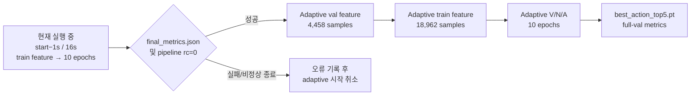

# GoalStep Adaptive Transition MR24+8 구현·실행 Handoff

- 작성/실행일: 2026-07-22 UTC
- 실험 ID: `RETRO-GS-TRANS-CLOSE20-CAP2-G025-ADAPT32-MR24x8`
- 실행 config: `configs/step1/goalstep/z1_adaptive_transition_mr24x8_vna_ep10.yaml`
- 상태: 구현·인덱스·CPU/실영상 smoke 검증 완료, 선행 16초 실험 직후 자동 실행 대기
- 상세 설계: [Adaptive Transition Window 제안](2026-07-22_goalstep-adaptive-transition-window-proposal.md)

## 1. 실행 요약

현재 `action_start−1s / 16s / 10 epoch` pipeline을 중단하지 않고, 성공적으로
끝나는 즉시 adaptive 실험이 시작되도록 별도 tmux queue를 기동했다.



기동 시각인 13:20 UTC 기준 선행 16초 cache는 validation 7,214/7,214,
train 약 10,176/30,374였다. 실측 처리속도 기준 전체 chain 예상 종료는
17:30–18:10 UTC다.

## 2. 정확한 예측 계약


같은 video와 같은 annotation level에서 시간순으로 바로 이어지는 `A1 → A2`를
구성한다. 모델은 A1만 보고 A2를 맞힌다.

```text
eligibility
  same video, same level, immediate successor
  A2.start >= A1.end
  A1.duration >= 1.0s
  gap <= min(2.0s, 0.20 * A1.duration)

observation
  cutoff    = A1.end - 0.25s
  obs_start = max(A1.start, cutoff - 32s)
  observe   = [obs_start, cutoff]
  target    = A2 verb / noun / action
```

`inter_action_gap_sec`, `A2.start`, 실제 target horizon은 index의 cohort 감사와
평가 group 구성에만 사용한다. feature cache와 model forward에는 전달하지 않는다.

## 3. 데이터와 sampling

생성 인덱스:

```text
src/ego/step1_action_anticipation/goalstep/index_adaptive_transition_mr24x8/
├── train.parquet          18,962
├── val.parquet             4,458
├── action_registry.json
├── video_uids.txt
└── build_stats.json
```

| Split | 전체 same-level 후보 | overlap 제외 | A1<1s 제외 | adaptive gap 제외 | 최종 |
|---|---:|---:|---:|---:|---:|
| Train | 29,938 | 375 | 50 | 10,551 | **18,962** |
| Validation | 7,100 | 84 | 6 | 2,552 | **4,458** |

train/validation video는 겹치지 않으며, 최종 681개 video를 사용한다. observation
길이는 약 0.75–32초이고 실제 A2 horizon은 0.25–2.25초다.


- global 24 frames: 전체 observation
- terminal 8 frames: cutoff 직전 2초
- 두 stream을 합친 뒤 timestamp 순으로 stable sort
- native frame 변환 시 시작은 `ceil`, 끝은 `floor`로 clamp하여
  `obs_start <= decoded frame time <= obs_end` 보장
- 고정 predictor conditioning: 1초
- predictor position grid: 2 FPS, 즉 1 tubelet skip

`frames_per_second=2`는 adaptive observation의 물리적 FPS가 아니다. 직전
`start−1s / 16s`와 predictor 위치를 동일하게 만드는 명목상 position grid다.

## 4. Probe metadata와 cache 계약

frozen V-JEPA2 feature 외에 다음 정보만 probe용으로 cache한다.

- observation duration
- 전체 A1 duration
- 실제 디코딩 frame의 observation-relative normalized timestamp 32개
- terminal-frame mask 32개
- annotation level ID: step 0 / substep 1

32개의 time metadata token과 1개의 level token을 기존 V-JEPA2 token 뒤에 붙인 뒤
동일 attentive pooler가 읽는다. `gap`, `allowed_gap`, `target_start/end`, 실제 horizon,
guard는 cache에 없다.

새 cache 위치:

```text
../datasets/Ego4D/goalstep_feature_cache_adaptive_transition_mr24x8_vna/
├── val/
└── train/
```

observation과 frame 구성이 기존 cache와 다르므로 신규 V-JEPA2 feature extraction은
필수다. 기존 uniform cache schema는 변경하지 않았고, 현재 선행 16초 extraction에도
adaptive metadata가 섞이지 않는다.

## 5. 학습·평가 출력

학습 조건:

| 항목 | 값 |
|---|---|
| Epoch | 10 |
| Heads | verb / noun / action |
| Batch | 32 |
| Precision | BF16 train, FP32 eval |
| Optimizer | AdamW |
| Validation per epoch | seed 42 고정 2,000 samples |
| Checkpoint selection | validation subset action Top-5 |

매 epoch와 최종 full validation에 다음 지표를 저장한다.

- verb/noun/action CMR@5
- verb/noun/action Top-1, Top-5, Top-10, Top-15 accuracy
- gap: `0–0.5`, `0.5–1`, `1–2s`
- level: step / substep
- transition: same class / different class
- A1 duration: `1–8`, `8–16`, `16–32`, `>32s`

출력 위치:

```text
outputs/goalstep/runs/z1_adaptive_transition_mr24x8_vna_ep10/
├── logs/
├── checkpoints/epoch_01.pt ... epoch_10.pt
├── best.pt
├── best_action_top5.pt
├── latest.pt
├── training_history.csv
├── metrics_per_epoch.json
└── final_metrics.json
```

## 6. tmux와 웹 UI

tmux session:

```text
ego_goalstep_adaptive_transition
├── queue       선행 성공 감시 및 adaptive pipeline 실행
├── dashboard   127.0.0.1:17868
└── tunnel      Cloudflare quick tunnel
```

확인 명령:

```bash
tmux attach -t ego_goalstep_adaptive_transition
tail -f outputs/goalstep/runs/z1_adaptive_transition_mr24x8_vna_ep10/logs/queue.log
```

- 전체 실험 통합 UI: <https://parts-sleeve-handbook-bidder.trycloudflare.com>
- adaptive 전용 UI: <https://intervention-stamps-advocacy-oral.trycloudflare.com>
- local: `http://127.0.0.1:17867`, `http://127.0.0.1:17868`

두 공개 URL과 `/api/status` 응답을 실제 확인했다. quick-tunnel URL은 cloudflared를
재시작하면 바뀔 수 있지만, tmux가 살아 있는 동안에는 SSH/Codex 연결과 무관하게
계속 서비스된다.

## 7. 구현·검증 범위

주요 구현 파일:

```text
src/ego/step1_action_anticipation/goalstep/build_goalstep_adaptive_transition_index.py
src/ego/datasets/video_sampling.py
src/ego/datasets/ego4d.py
src/ego/step1_action_anticipation/data/feature_cache.py
src/ego/step1_action_anticipation/models/anticipation_head.py
scripts/step1/ego4d_lta/extract_features.py
scripts/step1/ego4d_lta/train_lta_z1.py
src/ego/step1_action_anticipation/goalstep/train_goalstep_z1.py
scripts/step1/goalstep/evaluate_checkpoint_full.py
tools/goalstep_live_dashboard.py
tools/goalstep_experiments_dashboard.py
```

검증 결과:

- 실제 annotation에서 인덱스 재생성 결과 parquet과 일치
- train 18,962 / val 4,458 회귀 확인
- same-video, same-level immediate `A1 → A2` 및 target action ID 확인
- 전체 index의 경계·gap·split 불변식 확인
- 실제 30 FPS 영상 decode + production transform: `[3, 32, 256, 256]`
- 전체 row의 sampled frame 인과성·시간순·terminal 8개 확인
- fake backbone을 통한 실제 cache write/read smoke
- adaptive metadata head와 기존 legacy head forward smoke
- fake cache 1-epoch CPU trainer 및 checkpoint/전체 metric 저장 smoke
- Python compile 및 shell syntax 검사

환경에 `pytest` executable이 없어 test 함수는 프로젝트 Python에서 직접 호출했고
5개가 통과했다.

## 8. 반드시 유지할 해석 한계

1. **Oracle boundary upper-bound**: A1의 start/end, duration, level을 annotation에서
   정확히 안다는 가정이다. online 배포에는 boundary/completion detector가 필요하다.
2. **Close-pair conditional task**: adaptive 규칙으로 가까운 successor만 선택했으므로
   전체 GoalStep 시점의 무조건적 다음-action 정확도가 아니다.
3. **Variable actual horizon**: A2는 cutoff 이후 0.25–2.25초에 시작하지만 predictor는
   비교 통제를 위해 고정 1초다.
4. **Frozen encoder time semantics**: encoder는 비균일 32프레임을 균일 16-tubelet
   grid처럼 읽는다. timestamp metadata는 encoder 이후 probe token으로만 들어간다.
5. **현재 run은 단일 discovery arm**: 기존 16초 결과와는 cohort, sampling,
   metadata head가 동시에 다르다. 빈 구간 제거만의 효과는 matched A/B/C 없이는
   인과적으로 주장할 수 없다.
6. **Endpoint duplicate**: global/terminal stream이 둘 다 cutoff를 포함해 endpoint
   frame 하나는 의도적으로 중복된다. 실행에는 문제가 없고 report가 중복을
   허용하지만, 32 unique frames 실험은 별도 ablation이다.
7. **임시 공개 URL**: Cloudflare quick tunnel은 영구 배포 주소가 아니다.

이 제약 때문에 이번 결과는 “oracle 경계와 close-transition 조건에서 MR24+8이
유용한가”를 보는 1차 upper-bound로 해석해야 한다.
