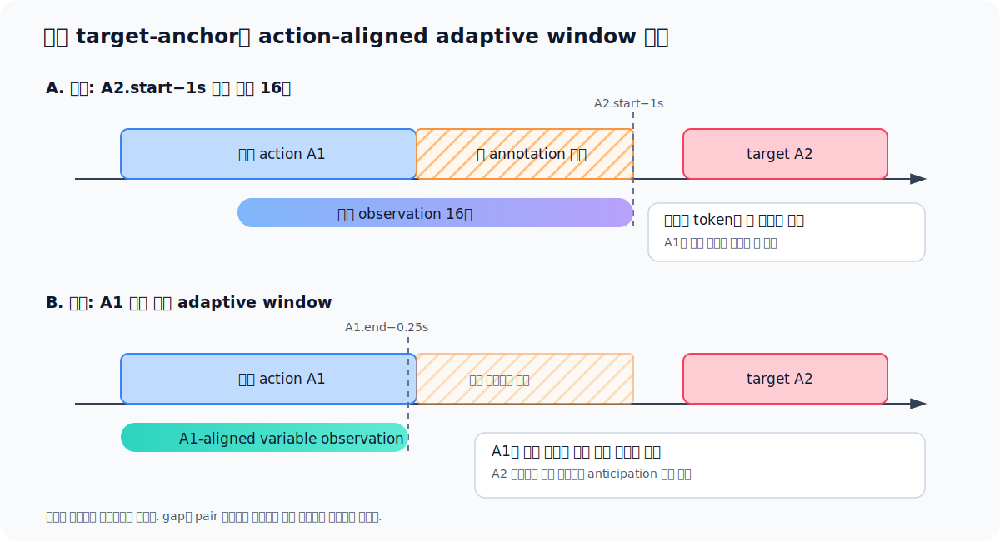
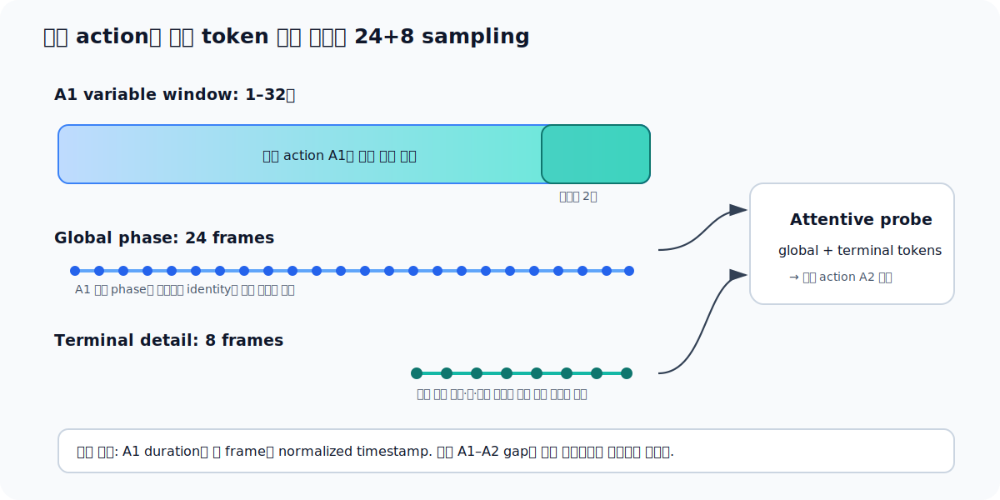
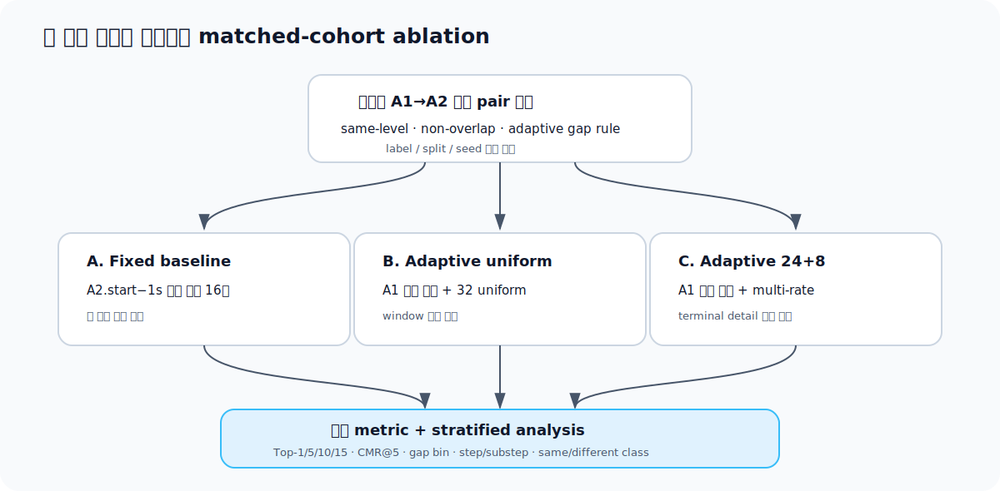

# GoalStep 연속 action 예측을 위한 Adaptive Transition Window 제안

- 작성일: 2026-07-22
- 대상: Ego4D GoalStep Step-1 action anticipation
- 상태: MR24+8 구현·인덱스 생성·실행 전 검증 완료, 16초 실험 직후 실행 대기
- 핵심 질문: 고정 observation에 포함되는 action 사이의 빈 구간이 성능 하락의
  원인이라면, 직전 action 경계에 맞춘 가변 observation이 attentive probe에 더
  유효한가?
- 실제 실행·운영 정보:
  [Adaptive Transition MR24+8 구현 Handoff](2026-07-22_goalstep-adaptive-transition-implementation-handoff.md)

## 1. 요약

기존 `action_start-1s / 8s` 또는 `16s` 설정은 예측할 target action `A2`의 시작
시각을 기준으로 고정 길이 observation을 만든다. 직전 action `A1`과 `A2` 사이에
annotation 공백이 길면 observation의 가장 최근 부분이 동작 정보가 적은 빈 구간이
된다. 이때 attentive probe가 실제 transition cue보다 배경·정지·무관한 움직임에
attention을 줄 수 있다.

이 문서는 observation을 target 시각에 고정하지 않고 **직전 action `A1`의 실제
경계와 길이에 정렬**하는 방법을 제안한다.

권장 기본 계약은 다음과 같다.

```text
pair eligibility
  same video
  same annotation level
  A2.start >= A1.end
  gap = A2.start - A1.end
  gap <= min(2.0s, 0.20 * A1.duration)
  A1.duration >= 1.0s

adaptive observation
  cutoff    = A1.end - 0.25s
  obs_start = max(A1.start, cutoff - 32s)
  observe   = [obs_start, cutoff]
  target    = A2
```

`A1.duration >= 1s`까지 실제 builder에 적용한 최종 규모는 train 18,962 pair,
validation 4,458 pair다. 기존
고정-window baseline과 비교할 때에는 반드시 이 **동일 pair cohort**를 사용해야
selection bias와 window 효과를 구분할 수 있다.

## 2. 문제: target 기준 고정 창이 빈 구간을 포함한다



기존 고정 창은 다음과 같다.

```text
observation = [A2.start - 1s - L_obs, A2.start - 1s]
target      = A2
```

`A1.end`와 `A2.start` 사이의 gap이 길수록 observation 후반부에 빈 공간이 많이
들어간다. 이는 두 가지 문제를 만든다.

1. 가장 최근 token이 실제 action-ending cue가 아닐 수 있다.
2. 고정 32프레임으로 resample할 때 정보가 적은 gap에 frame budget이 사용된다.

제안 방식은 observation을 `A1.end`에 정렬한다. 따라서 A1의 물체 상태, 손 위치,
마지막 동작과 완료 상태가 observation 끝에 남는다. 정답은 A2이므로 A2의 실제
frame을 보는 recognition leakage는 없다.

중요한 점은 이 설정이 “A1과 A2를 모두 본다”는 뜻이 아니라는 것이다. 모델은
**A1만 관찰하고 A2를 예측**한다. A2까지 observation에 넣으면 다시 action
recognition이 된다.

## 3. GoalStep annotation 통계

통계는
`src/ego/step1_action_anticipation/goalstep/taxonomy/goalstep_step_labels.csv`에서
같은 video·같은 annotation level의 시간순 successor를 구성해 계산했다.

### 3.1 step/substep 중첩 제거

GoalStep의 step과 substep은 계층적으로 중첩된다. 단순히 전체 행에서 다음 행을
선택하면 이미 진행 중이거나 과거에 시작한 action을 “다음 action”으로 고를 수
있다.

| Split | 전체 same-level successor | 음수 gap, 즉 overlap | non-overlap |
|---|---:|---:|---:|
| Train | 29,938 | 375 | 29,563 |
| Validation | 7,100 | 84 | 7,016 |

따라서 pair는 반드시 다음 조건을 만족해야 한다.

```text
A1.level == A2.level
A2.start >= A1.end
```

### 3.2 gap threshold별 유지 표본

non-overlap pair를 기준으로 한 결과다.

| 최대 gap | Train | Train 비율 | Validation | Validation 비율 |
|---:|---:|---:|---:|---:|
| 0.25s | 12,110 | 41.0% | 2,771 | 39.5% |
| 0.5s | 14,739 | 49.9% | 3,434 | 48.9% |
| 1s | 17,564 | 59.4% | 4,161 | 59.3% |
| 2s | 20,250 | 68.5% | 4,791 | 68.3% |
| 5s | 23,372 | 79.1% | 5,494 | 78.3% |

절대 `gap<=2s`는 충분히 많은 pair를 유지하지만, 1초짜리 매우 짧은 A1에도 2초
공백을 허용한다. 이를 보완하기 위해 A1 길이에 비례한 adaptive threshold를
사용한다.

```text
gap <= min(2.0s, 0.20 * A1.duration)
```

| 규칙 | Train | 비율 | Validation | 비율 |
|---|---:|---:|---:|---:|
| 절대 gap≤1s | 17,564 | 59.4% | 4,161 | 59.3% |
| 절대 gap≤2s | 20,250 | 68.5% | 4,791 | 68.3% |
| **20%×A1 duration, 최대 2s** | **18,962** | **64.1%** | **4,458** | **63.5%** |

초기 통계의 train 18,974는 `A1.duration >= 1s` 필터 적용 전 수치였다. 실제
인덱스와 이후 모든 실행·UI에서는 필터 적용 후 수치인 **18,962**를 사용한다.

권장 규칙은 절대 1초보다 표본을 더 유지하면서, 짧은 action에 대해 더 엄격한
연속성 조건을 적용한다. 또한 A1의 관측 가능한 정보만으로 threshold가 정해진다.

### 3.3 직전 action 길이

절대 `gap<=2s` cohort에서 A1 duration 분포는 다음과 같다.

| 통계 | Train | Validation |
|---|---:|---:|
| 중앙값 | 12.31s | 12.43s |
| 75 percentile | 28.99s | 30.20s |
| 90 percentile | 64.43s | 66.41s |
| duration≥1s | 99.8% | 99.9% |
| duration≤32s | 77.3% | 76.2% |

따라서 최소 길이를 1초로 두어도 표본 손실은 거의 없다. 최대 32초 cap을 사용하면
약 76–77%의 pair에서 A1 전체를 보고, 나머지는 transition에 가까운 마지막 32초를
본다. 32초는 고정 observation 길이가 아니라 **상한**이며 실제 observation은
약 0.75–32초 사이로 변한다. 최소 A1 길이는 1초지만 종료 직전 0.25초 guard를
관찰에서 빼므로 실제 최소 observation은 약 0.75초다.

## 4. 권장 Adaptive Transition Window

### 4.1 Pair 선정

각 video에서 step과 substep을 별도의 시간열로 처리한다.

```python
gap = A2.start - A1.end
eligible = (
    A1.video_uid == A2.video_uid
    and A1.level == A2.level
    and A2.start >= A1.end
    and A1.duration >= 1.0
    and gap <= min(2.0, 0.20 * A1.duration)
)
```

`gap`은 supervised cohort를 구축하는 데만 사용한다. 실제 inference에서 A2의
시작을 미리 알 수 없으므로 gap을 모델 feature, predictor conditioning 또는 probe
입력으로 제공해서는 안 된다.

### 4.2 Observation 경계

```text
guard_sec = 0.25
max_observation_sec = 32

cutoff    = A1.end - guard_sec
obs_start = max(A1.start, cutoff - max_observation_sec)
obs_end   = cutoff
label     = A2
```

`guard_sec=0.25`는 annotation endpoint와 decoder의 inclusive/exclusive 처리 차이
때문에 우연히 경계 이후 frame이 들어가는 것을 방지한다. 구현 sampler는 요청
timestamp를 native frame으로 바꿀 때 observation 끝을 `floor`하고, 모든 frame이
`decoded_frame_time <= obs_end`를 만족하도록 다시 clamp한다. 경계 노이즈에 더
보수적인 실험에서는 0.5초 guard도 함께 비교한다.

### 4.3 Frame sampling



가변 길이 A1에서 32프레임을 단순 균일 추출하면 긴 action의 종료 동작 해상도가
낮아진다. 다음 multi-rate sampling을 권장한다.

| Token group | Frame 수 | 범위 | 역할 |
|---|---:|---|---|
| Global phase | 24 | 전체 adaptive observation | A1 identity와 진행 단계 |
| Terminal detail | 8 | observation 마지막 2초 | 완료 상태와 transition cue |

중복 frame은 허용하거나 짧은 action에서는 unique frame 후 endpoint padding을 할 수
있다. 시간 순서를 유지해 32프레임 tensor로 결합한다.

attentive probe에는 다음 시간 정보가 추가로 필요하다.

- `observation_duration_sec`와 `A1_duration_sec`
- 각 frame의 `[0,1]` normalized timestamp
- `annotation_level` embedding (`step=0`, `substep=1`)

실제 gap은 제공하지 않는다.

## 5. V-JEPA2와 attentive probe 계약

가변 physical duration을 고정 32프레임으로 바꾸면 sample마다 실효 FPS가 달라진다.
현재 single-horizon V-JEPA2 cache는 고정 window와 고정 1초 conditioning으로 만들어져
있으므로 그대로 재사용할 수 없다.

### 5.1 1차 ablation

빈 구간 제거 효과를 먼저 분리하기 위해 predictor 설정은 기존과 동일하게 유지한다.
구현 config의 `frames_per_second=2`는 adaptive 영상의 물리적 FPS가 아니라 V-JEPA2
predictor position grid다. 직전 `action_start−1s / 16s`와 동일하게 고정 1초가
1 tubelet skip이 되도록 2 FPS를 사용한다.

- backbone 및 predictor weights 동일
- 기본 attentive-probe depth/head와 V/N/A classifier 출력 구조 동일
- optimizer, epoch, seed 동일
- target pair 동일
- 바뀌는 것: observation alignment와 frame sampling

단, 현재 MR24+8 구현은 duration/timestamp/terminal-mask/annotation-level token을
probe에 추가한다. 따라서 기존 16초 전체-dataset 결과와의 직접 비교에는 cohort,
sampling, probe metadata가 동시에 달라지는 confound가 있다. 빈 구간 제거만의 인과적
효과를 주장하려면 Section 6의 matched A/B/C를 실행하고, 각 arm에 동일 metadata
인터페이스를 적용하거나 metadata 없는 C0와 metadata를 쓰는 C1을 분리해야 한다.

### 5.2 후속 multi-horizon 실험

이 task의 실제 A2 시작 horizon은 고정되지 않는다. 그러나 실제 gap을 입력하면 미래
정보 누수가 된다. 후속 실험에서는 실제 gap 대신 고정 horizon bank를 만들 수 있다.

```text
horizon tokens = predictor(0.5s) + predictor(1.0s) + predictor(2.0s)
attentive probe = attention over global, terminal, multi-horizon tokens
```

probe가 관찰만으로 유효한 horizon token에 attention하도록 한다. 이는 single
1-second predictor보다 variable transition task에 적합할 가능성이 있지만, 빈 구간
가설과 predictor 변경 효과가 섞이므로 1차 ablation 이후에 수행해야 한다.

## 6. 공정한 Ablation 설계



성능 상승이 단순히 가까운 action pair만 골랐기 때문인지, adaptive observation
때문인지 구분해야 한다. 아래 세 실험은 동일한 adaptive-rule pair 목록을 사용한다.

| ID | Observation | Sampling | 검증 대상 |
|---|---|---|---|
| A | `A2.start−1s` 이전 고정 16초 | 기존 uniform | matched baseline |
| B | A1-aligned 0.75–32초 | 32 uniform | 빈 공간 제거·경계 정렬 효과 |
| C | A1-aligned 0.75–32초 | 24 global + 8 terminal | terminal detail 효과 |

다음 조건은 모두 고정한다.

- train/validation sample identity
- verb/noun/action labels와 registry
- split, seed, validation subset
- backbone/predictor checkpoint
- attentive probe 구조
- optimizer, learning rate, focal loss, epoch

### 반드시 함께 보고할 평가

- verb/noun/action CMR@5
- verb/noun/action Top-1, Top-5, Top-10, Top-15
- gap bin: `0–0.5`, `0.5–1`, `1–2초`
- level: step / substep
- transition: A1과 A2가 같은 class / 다른 class
- A1 duration bin: `1–8`, `8–16`, `16–32`, `>32초`

전체 dataset의 기존 결과와 adaptive cohort 결과를 직접 비교하는 숫자도 참고로
표시할 수 있지만, window 효과의 결론은 A/B/C matched 비교에서 내려야 한다.

## 7. 기대되는 attentive probe 동작

adaptive window에서는 모든 sample의 마지막 token들이 동일한 의미를 갖는다.

```text
초반 token  -> A1의 정체와 준비 상태
중간 token  -> A1의 진행 과정
마지막 token -> A1 완료 직전 상태와 다음 동작을 유도하는 cue
```

고정 target-anchor window에서는 마지막 token이 action-ending cue일 수도 있고 빈
공간일 수도 있다. 반면 adaptive alignment는 attention의 시간적 의미를 sample 간에
일관되게 만든다. 이것이 단순히 observation을 길게 늘리는 것보다 attentive probe에
더 직접적인 이점이다.

## 8. 한계와 해석 주의사항

### 8.1 Oracle action boundary

학습·평가에서는 annotation의 `A1.end`를 정확히 안다고 가정한다. 실제 online
시스템은 action boundary detector 또는 action completion detector가 필요하다.
따라서 이 실험은 먼저 **oracle-boundary upper-bound**를 측정한다.

### 8.2 Close-pair conditional task

adaptive gap 규칙은 다음 action이 가까이 존재하는 sample만 남긴다. 결과는
“연속 action이 존재하는 조건에서의 다음-action 정확도”이며 모든 GoalStep 시점에
대한 일반 성능이 아니다.

### 8.3 미래 gap을 입력할 수 없음

pair를 사후 구성할 때 gap을 사용할 수 있지만 inference 시점에는 A2가 언제 시작할지
알 수 없다. 실제 gap 또는 A2.start를 모델에 제공하면 leakage다.

### 8.4 Step과 substep의 다른 의미

step transition과 substep transition의 추상화 수준이 다르다. 같은-level 조건으로
교차 오염은 막지만 한 모델에서 두 종류가 섞인다. level별 metric과 level embedding이
필요하며, 필요하면 별도 모델 ablation을 수행한다.

### 8.5 가변 FPS 및 position semantics

동일 32프레임이 1초 action과 32초 action을 모두 나타내므로 물리적 frame 간격이
다르다. duration과 normalized timestamp를 probe에 전달하지 않으면 속도 정보가
사라지고 V-JEPA2의 원래 시간 의미와 어긋날 수 있다.

현재 구현도 frozen V-JEPA2 encoder 자체에는 timestamp 입력 인터페이스가 없어서,
비균일 32프레임을 내부적으로 균일한 16 tubelet grid로 해석한다. 실제 timestamp와
duration은 encoder 이후 별도 probe token으로만 추가된다. 따라서 visual tubelet과
실제 시간이 encoder 안에서 직접 결합되는 구현은 아니며, 이번 결과는 이 제약을
가진 1차 upper-bound로 해석해야 한다.

### 8.6 같은 class의 연속 segment

최종 adaptive cohort에서 A1과 A2의 action class가 같은 pair는 train 1,720개,
validation 394개다. 서로 다른 시간 segment이므로 유효한 next label이지만 단순
continuation 성능을 높일 수 있다. 같은-class와 different-class 결과를 분리해
보고해야 한다.

### 8.7 신규 feature extraction 필요

현재 cache는 고정 observation에서 V-JEPA2를 실행한 결과다. adaptive 경계와
multi-rate frame 구성이 달라지므로 새 index뿐 아니라 새 feature extraction도
필요하다. 장기적으로 frame-level reusable cache를 만들면 후속 window ablation의
중복 backbone 연산을 줄일 수 있다.

## 9. 구현 체크리스트

1. [x] 같은-level strict successor pair builder 작성
2. [x] adaptive gap rule 및 제외 사유를 index/build stats에 기록
3. [x] `A1_*`, `A2_*`, gap, `obs_*`, `guard_sec` audit column 저장
4. [x] 확정한 단일 규칙을 train/validation에 동일 적용
5. [ ] matched B용 adaptive uniform sampler/config
6. [x] 24+8 multi-rate sampler 구현
7. [x] observation/A1 duration, normalized-time, terminal mask, level metadata 전달
8. [ ] 새 V-JEPA2 feature cache 추출 — 16초 실험 완료 직후 자동 시작
9. [ ] matched A/B/C 10-epoch 학습 — 현재는 C 계열 단일 discovery run만 예약
10. [x] gap/level/duration/same-class별 CMR@5·Top-1/5/10/15 저장 코드

### 9.1 실제 구현 산출물

```text
builder
  src/ego/step1_action_anticipation/goalstep/
    build_goalstep_adaptive_transition_index.py

index
  src/ego/step1_action_anticipation/goalstep/
    index_adaptive_transition_mr24x8/
      train.parquet          18,962
      val.parquet             4,458
      action_registry.json
      build_stats.json

config / launcher
  configs/step1/goalstep/z1_adaptive_transition_mr24x8_vna_ep10.yaml
  scripts/step1/goalstep/run_adaptive_transition_mr24x8_vna_ep10.sh
  scripts/step1/goalstep/queue_adaptive_after_start_m1_lobs16.sh
  scripts/step1/goalstep/start_tmux_adaptive_after_lobs16.sh

outputs
  ../datasets/Ego4D/goalstep_feature_cache_adaptive_transition_mr24x8_vna/
  outputs/goalstep/runs/z1_adaptive_transition_mr24x8_vna_ep10/
```

모델 입력 cache에는 observation/A1 duration, normalized timestamp, terminal mask,
level만 저장한다. `inter_action_gap_sec`, `target_horizon_sec`, `A2.start`는 index의
감사·사후 평가용이며 모델 forward에는 전달하지 않는다.

권장 실험 ID:

```text
RETRO-GS-TRANS-CLOSE20-CAP2-G025-ADAPT32-U32
RETRO-GS-TRANS-CLOSE20-CAP2-G025-ADAPT32-MR24x8
```

## 10. 최종 권고

다음 단계는 전체 GoalStep pipeline을 곧바로 adaptive 방식으로 교체하는 것이 아니라,
동일 close-transition pair에서 A/B/C를 비교하는 것이다. 이 비교에서 B가 A보다
일관되게 높고 C가 B보다 추가로 높다면 다음 결론을 분리해서 지지할 수 있다.

1. A1–A2 사이의 빈 구간이 성능을 낮춘다.
2. 직전 action 경계 정렬이 attentive probe의 시간적 attention을 안정화한다.
3. 종료 직전 dense sampling이 다음-action transition cue를 보존한다.

그 후에야 multi-horizon predictor와 실제 online boundary detector로 확장하는 것이
타당하다.
