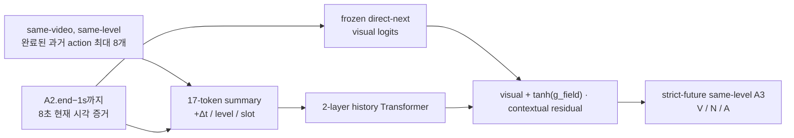
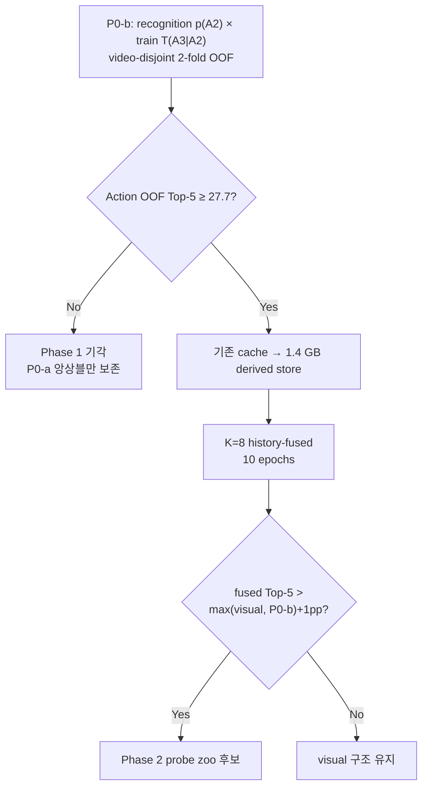

> **SUPERSEDED — 2026-07-23:** 이 문서는 초기 P0-b hard-gate 시점의 실행 기록이며, 이후 P0-a를 foundation으로 Phase 1/2까지 완료한 최종 계약·코드·결과는 [2026-07-23_goalstep-history-p0a-phase1-phase2-final-report.md](2026-07-23_goalstep-history-p0a-phase1-phase2-final-report.md)를 따른다. 특히 아래의 “P0-b FAIL → Phase 1 미실행” 결론은 더 이상 현재 상태가 아니다.

# GoalStep History Context K=8 구현·실행 Handoff

- 실행 시작: 2026-07-23 KST (2026-07-22 UTC)
- 기준 문서: `2026-07-23_history_context_champion_recipe_plan.md`
- 현재 계약: **A2.end−1s까지 8초 관찰 + 과거 시각 history → strict-future same-level A3**
- 실행 세션: `ego_goalstep_history_champion` (`phase0`, `pipeline` 창)

## 1. 결론

1. **새 V-JEPA/backbone feature 추출은 필요 없다.** 기존
   `goalstep_feature_cache_end_m1_lobs8_vna` 30,374/7,214개를 전부 재사용한다.
2. 다만 K=8 history를 10 epoch마다 원본 피처에서 반복 로드하면
   약 20 TB I/O가 되므로, 기존 피처를 읽어 **17개 temporal summary**로
   압축한 약 1.4 GB 파생 store를 한 번 만든다. 이것은 영상 디코딩이나
   backbone 재추출이 아니다.
3. 원본 bank는 train 30,374 / val 7,214이지만, 다음 same-level action이
   있어 A3 정답을 만들 수 있는 실제 target cohort는 **train 29,293 / val
   6,960**이다. 마지막 action 등 1,081/254개는 제외된다.
4. adaptive A1 boundary · MR24+8은 train feature 12,472/18,962에서 안전하게
   일시중단했다. val 4,458개는 완료되었고, 남은 train 6,490개는
   기존 스크립트 재실행 시 cache skip으로 재개할 수 있다.

## 2. 예측 계약



- 현재 관찰의 라벨 A2를 맞히는 recognition 실험이 아니다.
- A2 뒤의 **다음 same-level action A3**가 유일한 target이다.
- history는 `history_action_end <= A2.start`를 만족하는 시각 segment만 쓴다.
  따라서 현재 A2나 target A3의 시각 증거가 history에 섞이지 않는다.
- action 사이에 빈 시간이 있어도 action 연결을 끊지 않고, 그 간격은
  `log1p(Δt)` 임베딩으로 모델에 제공한다.

## 3. 데이터 사용량

| 용도 | Train | Val | 설명 |
|---|---:|---:|---|
| 기존 endpoint feature bank | 30,374 | 7,214 | 원본 V-JEPA 피처 전체, 완비 |
| strict-next target cohort | **29,293** | **6,960** | A3가 존재하는 행 |
| history K=8 완충 | 22,107 | 5,202 | 최대 8개 과거 segment |
| history 0개 | 1,043 | 249 | padding+mask로 포함 |
| 평균 history 길이 | 6.845 | 6.820 | target 행을 제외하지 않음 |

## 4. 실행 순서와 기계적 게이트



- P0-b 전이행렬은 **train 29,293행만** 사용한다.
- temperature/α는 video-disjoint 2-fold OOF로 선택한다.
- P0-a는 동일 A2 endpoint를 본 direct-next epoch 1–8 checkpoint를 V/N/A 별로
  선발한다.
- Phase 1은 P0-b JSON의 threshold·PASS를 코드로 재검증해, FAIL이면
  trainer가 시작되지 않는다.

## 5. Phase 1 구현

- 입력: `[B, current+8, 17, 1024]`
- segment pooler: 공유 1-block cross-attention
- context: `log1p(Δt)` MLP + level/slot embedding + 2-layer Transformer
- history-only: current token을 절대 보지 않는 별도 pass
- fused: `frozen_visual_logits + tanh(g_field) * contextual_logits`
- V/N/A 각 gate는 0 초기화; epoch 0에 fused와 visual이 bit-exact로 같음
- history segment dropout 0.3, history-only auxiliary focal loss 0.25
- 10 epochs, batch 32, bf16, full validation every epoch
- checkpoint 선택: `fused.action.top5`; epoch 0 visual fallback도 best 후보에 포함
- 평가: visual/history/current-only/fused × verb/noun/action의 CMR@5, Top-1/5/10/15,
  history-length bin, field gate 값
- current-only는 동일한 추가 current branch에서 history token만 제거한 인과적
  대조군이다. `fused − current-only`로 추가 current probe 효과와 실제 history
  효과를 분리한다.

## 6. 산출물

| 종류 | 경로 |
|---|---|
| P0 runner | `scripts/step1/goalstep/run_history_phase0.py` |
| history index builder | `src/ego/step1_action_anticipation/goalstep/build_goalstep_history_index.py` |
| K=8 index | `src/ego/step1_action_anticipation/goalstep/index_end_m1_lobs8_next_action_history_k8/` |
| derived-store builder | `scripts/step1/goalstep/prepare_history_context_store.py` |
| model | `src/ego/step1_action_anticipation/models/history_context_head.py` |
| trainer | `src/ego/step1_action_anticipation/goalstep/train_goalstep_history_context.py` |
| config | `configs/step1/goalstep/z1_history_context_k8_vna_ep10.yaml` |
| persistent pipeline | `scripts/step1/goalstep/run_history_context_champion_after_gate.sh` |
| Phase 0 output | `outputs/goalstep/runs/history_context_phase0/` |
| Phase 1 output | `outputs/goalstep/runs/z1_history_context_k8_vna_ep10/` |

## 7. 운영 상태

- tmux: `ego_goalstep_history_champion:phase0` 게이트 실행 중
- tmux: `ego_goalstep_history_champion:pipeline` 게이트 산출물 대기 중
- 후속 실행: P0-a → PASS 확인 → derived store → 10-epoch trainer
- 통합 UI: <https://parts-sleeve-handbook-bidder.trycloudflare.com>
- adaptive cache 재개 정보:
  `outputs/goalstep/runs/z1_adaptive_transition_mr24x8_vna_ep10/run_status.json`

## 8. 한계·주의

1. **Oracle boundary/level 구조**: history 멤버십과 same-level 체인을 GoalStep annotation
   boundary/level로 만든다. history class label은 입력하지 않지만, 온라인
   배포에서는 boundary/level estimator가 필요하다.
2. **공간 압축**: 과거 segment의 256 spatial token을 각 temporal slice에서 평균한다.
   이는 I/O를 약 20 TB/10 epochs에서 약 1.4 GB store로 줄이는 의도적
   근사이며, 원 계획의 full-spatial attentive pooling보다 history 표현력이 작을
   수 있다.
3. **피처 재추출 0 ≠ 전처리 0**: backbone은 안 돌지만, 기존 313 GB
   cache를 한 번 순회하며 summary/frozen logits를 생성하는 시간은 필요하다.
4. **trainer resume**: tmux는 SSH 종료를 견디지만 v1 trainer의 epoch resume는 없다.
   프로세스/노드 장애 시 새 output directory에서 epoch 0부터 재시작해야 한다.
5. derived shard 재사용은 config/checkpoint/index/cache file-stat/taxonomy/compression
   fingerprint가 같을 때만 허용하며, train/val provenance가 섞이면 trainer가
   fail-closed한다.
6. current-only는 동일 checkpoint의 inference-time intervention이다. 해당 checkpoint가
   history token에 의존하는 정도는 격리하지만, history가 학습 중 만든
   regularization/파라미터 학습 효과까지 분리하지는 않는다. 엄격한 후속
   ablation은 독립 current-only 학습 arm 또는 shuffled-history control이 필요하다.

## 9. Phase 0 실측 결과 (2026-07-23 KST)

### P0-b: soft-mixture history gate

| 방법 | Top-1 | Top-5 | Top-10 | Top-15 | CMR@5 |
|---|---:|---:|---:|---:|---:|
| direct next-action best ep3 | 7.36 | 25.65 | 37.86 | 46.03 | 9.84 |
| **soft-mixture OOF** | **8.23** | **26.02** | **38.58** | **46.29** | 8.92 |
| GT A2 전이 oracle | 10.98 | 30.65 | 41.52 | 48.84 | 15.50 |

- soft-mixture Top-5 절대값: **26.02% < 27.70% → FAIL**
- direct ep3 대비: **+0.37pp**
- paired normal 95% CI: `[-0.72, +1.46]pp`
- video bootstrap 95% CI: `[-1.48, +2.41]pp`, `P(Δ>0)=0.655`
- 해석: GT A2 oracle 30.65가 보여 준 절차적 전이 정보는 존재하지만,
  recognition posterior를 통한 deployable soft mixing은 그 이득을 안정적으로 회수하지
  못했다. 이 결과는 learned visual history가 무조건 무익함을 증명하지는
  않지만, 사전 등록한 비용 게이트에 따라 Phase 1 학습은 기각한다.

### P0-a: same-decision checkpoint field ensemble

| Field | Top-1 | Top-5 | Top-10 | Top-15 | CMR@5 |
|---|---:|---:|---:|---:|---:|
| Verb | 21.62 | 55.80 | 71.72 | 80.83 | 19.21 |
| Noun | 29.41 | 56.34 | 68.62 | 75.83 | 13.53 |
| **Action** | **9.64** | **28.41** | **41.54** | **49.50** | **10.05** |

- action direct ep3 25.65 → OOF field ensemble **28.41 (+2.76pp)**
- paired normal 95% CI: `[+1.98, +3.53]pp`
- video bootstrap 95% CI: `[+1.67, +3.99]pp`, `P(Δ>0)=1.0`
- 판정: history gate는 미달했지만, 동일 A2.end−1s 증거만 쓰는 deployable
  P0-a는 사전 계획대로 채택할 가치가 있다.

### 최종 실행 판정

```text
P0-b gate: FAIL (26.02 < 27.70)
P0-a ensemble: PASS / adopt (28.41, +2.76pp vs direct)
Derived history store: 생성하지 않음
Phase-1 K=8 10-epoch training: 사전 등록 규칙에 따 미실행
Adaptive MR24+8: 계속 paused, cache 보존
```
