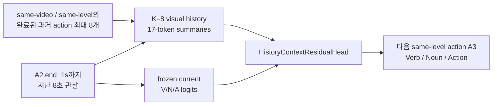

# A2.end−1s · visual history K=8 · Phase 1/2 모델 사용 Handoff

- 작성일: 2026-07-23 UTC
- Canonical repository: `/root/nvme/migration/jihun/EGO_jihun2`
- 실경로: `/mnt/nvme/migration/jihun/EGO_jihun2`
- 상태: Phase 1 10 epoch 완료, Phase 2 12-arm×10-epoch 후보군 및 OOF 평가 완료
- 상세 근거: [2026-07-23_goalstep-history-p0a-phase1-phase2-final-report.md](2026-07-23_goalstep-history-p0a-phase1-phase2-final-report.md)

## 0. 먼저 읽어야 할 결론

**바로 로드할 단일 모델**과 **보고된 최고 OOF 성능**은 다른 산출물이다.

| 구분 | 바로 사용할 산출물 | Action Top-5 | 정확한 의미 |
|---|---|---:|---|
| Phase 1 단일 모델 | `outputs/goalstep/runs/z1_history_context_k8_vna_ep10/best_action_top5.pt` | **30.6609** | epoch 6, 같은 full val에서 고른 exploratory maximum |
| Phase 1 authoritative OOF | `.../history_context_vs_p0a_oof_scores.pt` + `.../history_context_vs_p0a_results.json` | **30.3448** | fold/field별 epoch·P0-a blend recipe; 단일 모델이 아님 |
| Phase 2 단일 최고 후보 | `outputs/goalstep/runs/z1_history_context_probe_zoo_ep10/arms/lr_3e-04__wd_1e-02/checkpoints/epoch_06.pt` | **31.2213** | LR `3e-4`, WD `1e-2`, epoch 6; full-val exploratory maximum |
| Phase 2 authoritative OOF | `.../phase2_vs_p0a_oof_scores.pt` + `.../phase2_vs_p0a_results.json` | **31.2356** | fold/field별 checkpoint ensemble recipe; 단일 배포 모델이 아님 |

> **핵심 주의:** Phase 2의 `31.2356%`는 하나의 `best.pt`가 낸 점수가 아니다. 각 validation row에 held-out fold에 맞는 서로 다른 fieldwise ensemble을 적용한 OOF 평가 점수다. 새 sample에 어느 fold recipe를 적용할지는 아직 정의되지 않았다.

Phase 2 OOF는 Phase 1 incumbent보다 `+0.8908pp`, video-bootstrap 95% CI `[+0.1347, +1.6579]pp`로 **provisional engineering champion**으로 승격했다. untouched test에서 확인한 confirmatory 성능은 아니다.

---

## 1. 예측 계약



- 현재 관찰: A2의 `end−1s`를 끝으로 하는 8초.
- History membership: 같은 `video_uid`, 같은 annotation level에서 `history.end <= A2.start`인 완료 action 중 최근 8개.
- Target: `A3.start >= A2.end`를 만족하는 첫 strict-next same-level A3.
- A2와 A3 사이에 라벨링되지 않은 빈 시간이 있어도 target은 A3로 유지된다.
- History action의 GT verb/noun/action label은 모델 입력에 들어가지 않는다.
- 단, A2의 boundary와 annotation level은 주어진 oracle 조건이다. 임의의 online 영상에서는 별도 boundary/level estimator가 필요하다.

모델 입력 계약은 다음과 같다.

| 입력 | shape / dtype | 의미 |
|---|---|---|
| `summaries` | `[B,9,17,1024]`, fp32 | position 0=current; 나머지 8개는 left-padded oldest→newest history |
| `history_mask` | `[B,8]`, bool | valid history slot |
| `history_delta_t_sec` | `[B,8]`, fp32 | valid slot은 `current_obs_end − history_obs_end > 0`, padding은 0 |
| `history_level_id` | `[B,8]`, int64 | step=0, substep=1, padding=-1 |
| `visual_logits` | V `[B,81]`, N `[B,140]`, A `[B,293]` | frozen direct-next visual logits |

최종 예측은 `outputs["fused"]` 안의 `verb`, `noun`, `action` logits을 쓴다.

---

## 2. 모델 위치와 성능

### 2.1 Phase 1 단일 모델

Canonical checkpoint:

```text
outputs/goalstep/runs/z1_history_context_k8_vna_ep10/best_action_top5.pt
```

- checkpoint 내부 epoch: 6
- SHA-256: `1d20c942e7ec71ef76326679c44d20dead88e084dc8ac4367b7e3ebebdaa61cd`
- model + optimizer + scheduler + metrics 포함
- 다음 alias들은 file hash는 다르지만 `model_state`가 동일하다.

```text
outputs/goalstep/runs/z1_history_context_k8_vna_ep10/best.pt
outputs/goalstep/runs/z1_history_context_k8_vna_ep10/best_fullval_exploratory.pt
outputs/goalstep/runs/z1_history_context_k8_vna_ep10/checkpoints/epoch_06.pt
```

### 2.2 Phase 2 단일 최고 후보

Canonical standalone candidate:

```text
outputs/goalstep/runs/z1_history_context_probe_zoo_ep10/arms/lr_3e-04__wd_1e-02/checkpoints/epoch_06.pt
```

- LR: `3e-4`
- WD: `1e-2`
- checkpoint 내부 epoch: 6
- SHA-256: `dc8b2b62d179723dc7b4770a11ff5f02a541f69449e7ea3e84277386f5491bf6`
- model-only checkpoint; optimizer state 미포함
- `best_phase2.pt` alias는 의도적으로 만들지 않았다.
- architecture metadata가 checkpoint 안에 없으므로, 반드시 Phase 1 config·store manifest·모델 코드와 같이 사용해야 한다.

### 2.3 Action 평가 수치

| 산출물 | CMR@5 | Top-1 | Top-5 | Top-10 | Top-15 |
|---|---:|---:|---:|---:|---:|
| Phase 1 standalone epoch 6 | 12.6740 | 10.4454 | **30.6609** | 43.9224 | 52.6437 |
| Phase 1 final OOF recipe | 11.7771 | 10.2155 | **30.3448** | 44.1810 | 52.2988 |
| Phase 2 standalone LR3e-4/WD1e-2 epoch 6 | 13.0203 | 10.4885 | **31.2213** | 44.2385 | 52.2557 |
| Phase 2 final OOF recipe | 12.1219 | 10.2155 | **31.2356** | 44.0230 | 52.3851 |

standalone 수치는 같은 full val에서 checkpoint를 고른 탐색적 수치다. Phase 1/2의 authoritative 비교는 반대 fold에서만 선택한 OOF recipe를 기준으로 한다.

---

## 3. 다음 사용자가 필요한 데이터

### 3.1 기존 GoalStep validation에서 단일 모델을 돌릴 때

원본 313 GB feature bank를 다시 읽을 필요는 없다. 다음 compact store·index·registry가 필수다.

| 자산 | 경로 | 용도 |
|---|---|---|
| Derived store | `../datasets/Ego4D/goalstep_history_context_store/` | current/history `[17,1024]` summaries + frozen V/N/A visual logits |
| Store contract | `../datasets/Ego4D/goalstep_history_context_store/manifest.json` | shape, class 수, source checkpoint, shard hash/provenance |
| Validation annotation/index | `src/ego/step1_action_anticipation/goalstep/index_end_m1_lobs8_next_action_history_k8/val.parquet` | current/history ID, mask, Δt, level, A3 target label, audit boundary |
| ID registry | `src/ego/step1_action_anticipation/goalstep/index_end_m1_lobs8_next_action_history_k8/action_registry.json` | 81 verb / 140 noun / 293 action local ID 계약 |
| Model code | `src/ego/step1_action_anticipation/models/history_context_head.py` | `HistoryContextResidualHead` |
| Store/dataset loader | `src/ego/step1_action_anticipation/goalstep/train_goalstep_history_context.py` | `PreloadedHistoryStore`, `HistoryContextDataset` |
| Phase 1 config | `configs/step1/goalstep/z1_history_context_k8_vna_ep10.yaml` | architecture/data contract |

`val.parquet`의 label은 평가에만 필요하다. 모델 forward 자체는 A3 GT label을 입력으로 사용하지 않는다.

### 3.2 학습·finetune을 다시 할 때

추가로 다음이 필요하다.

```text
src/ego/step1_action_anticipation/goalstep/index_end_m1_lobs8_next_action_history_k8/train.parquet
src/ego/step1_action_anticipation/goalstep/index_end_m1_lobs8_next_action_history_k8/build_stats.json
../datasets/Ego4D/goalstep_history_context_store/train/
configs/step1/goalstep/z1_history_context_probe_zoo_ep10.yaml
src/ego/step1_action_anticipation/goalstep/train_goalstep_history_probe_zoo.py
```

| cohort | Train | Val |
|---|---:|---:|
| 원본 endpoint feature bank | 30,374 | 7,214 |
| strict-next A3 target가 있는 실제 cohort | **29,293** | **6,960** |
| validation videos / folds | — | 128 videos; 3,737 / 3,223 rows |

- Derived store는 train 30 shards, val 8 shards이며 전체 약 1.4 GB다.
- 저장된 summary는 fp16 `[N,17,1024]`; loader가 forward 직전 fp32로 바꾼다.
- Phase 1은 `epoch_00_visual_fallback.pt`, `epoch_01.pt`∼`epoch_10.pt`가 모두 있다.
- Phase 2는 새 11 arms×10 epochs = 110개 model-only checkpoint와 110개 validation prediction이 있다.
- Phase 2의 학습 상태 정확 재개는 개별 checkpoint가 아니라 `outputs/goalstep/runs/z1_history_context_probe_zoo_ep10/latest_resume.pt`를 쓴다.
- Phase 1 checkpoint에 optimizer/scheduler가 있지만, 현 trainer는 기존 output에 대한 in-place resume를 공식 지원하지 않는다.

### 3.3 Store를 재생성하거나 새 raw video를 추론할 때

기존 cohort에서는 store를 재사용했기 때문에 backbone 재추출이 필요 없었다. **새 raw video에 대해서는 동일한 V-JEPA feature 추출이 필요하다.**

| 자산 | 경로 / 설명 |
|---|---|
| 원본 feature cache | `../datasets/Ego4D/goalstep_feature_cache_end_m1_lobs8_vna/` |
| Frozen current visual checkpoint | `outputs/goalstep/runs/z1_end_m1_lobs8_next_action_vna_ep10/best.pt` |
| Visual checkpoint SHA-256 | `35b7cfdd2e5ea4f222ca5194b6b605f4f136ac0b3098c453616ad4e5990b8b18` |
| Human-readable taxonomy | `src/ego/step1_action_anticipation/goalstep/taxonomy/goalstep_verbnoun_taxonomy.json` |
| GoalStep label source | `src/ego/step1_action_anticipation/goalstep/taxonomy/goalstep_step_labels.csv` |
| Store builder | `scripts/step1/goalstep/prepare_history_context_store.py` |

새 sample에 대한 최소 절차는 다음과 같다.

1. upstream에서 A2 boundary와 annotation level을 구한다.
2. `A2.end−1s`까지 8초 current window와, 이전 same-level completed action 최대 8개의 V-JEPA feature를 기존 설정과 동일하게 추출한다.
3. 각 `[4352,1024] = [17,256,1024]` feature를 spatial 256 token 평균으로 `[17,1024]`로 압축한다.
4. History를 left padding한 뒤 oldest→newest 순으로 배치한다.
5. current window에 frozen direct-next visual checkpoint를 적용해 V/N/A logits을 만든다.
6. summary/mask/Δt/level/visual logits을 history head에 넣고 `outputs["fused"]`를 사용한다.

현재 코드에는 unlabeled new-video용 standalone inference CLI가 없다. `HistoryContextDataset`도 audit/label column을 요구하므로, 새 데이터에서는 위 계약을 만드는 추론 wrapper가 추가로 필요하다.

---

## 4. 기존 validation에서 단일 checkpoint 로드 예시

반드시 `eve-cu124` 환경을 사용한다. base system Python은 NumPy/PyTorch 혼합 문제가 있을 수 있다.

```bash
cd /root/nvme/migration/jihun/EGO_jihun2
export PYTHONPATH="$PWD/src"
/root/nvme/migration/jihun/envs/miniforge3/envs/eve-cu124/bin/python your_script.py
```

`your_script.py`의 최소 예시:

```python
from pathlib import Path

import torch
from torch.utils.data import default_collate

from ego.step1_action_anticipation.goalstep.train_goalstep_history_context import (
    HistoryContextDataset,
    PreloadedHistoryStore,
    _read_index,
)
from ego.step1_action_anticipation.models.history_context_head import (
    HistoryContextResidualHead,
)

repo = Path("/root/nvme/migration/jihun/EGO_jihun2")
store = PreloadedHistoryStore(
    (repo / "../datasets/Ego4D/goalstep_history_context_store").resolve(),
    "val",
)
index_dir = repo / (
    "src/ego/step1_action_anticipation/goalstep/"
    "index_end_m1_lobs8_next_action_history_k8"
)
frame, _ = _read_index(index_dir, "val")
dataset = HistoryContextDataset(frame, store, max_history=8)
batch = default_collate([dataset[0]])

model = HistoryContextResidualHead(
    num_classes=store.num_classes,
    embed_dim=1024,
    max_history=8,
    segment_pooler_heads=16,
    transformer_heads=16,
    transformer_layers=2,
    transformer_mlp_ratio=4.0,
    transformer_dropout=0.1,
    segment_dropout=0.3,
    recency_scale_sec=300.0,
)

# Phase 2 standalone을 쓰려면 아래 경로만 2.2의 checkpoint로 바꾸면 된다.
checkpoint_path = repo / (
    "outputs/goalstep/runs/z1_history_context_k8_vna_ep10/"
    "best_action_top5.pt"
)
checkpoint = torch.load(checkpoint_path, map_location="cpu", weights_only=True)
model.load_state_dict(checkpoint["model_state"], strict=True)
model.eval()

with torch.inference_mode():
    outputs = model(
        batch["summaries"].float(),
        batch["history_mask"],
        batch["history_delta_t_sec"],
        batch["history_level_id"],
        {head: value.float() for head, value in batch["visual_logits"].items()},
    )
    action_top5 = outputs["fused"]["action"].topk(5, dim=-1).indices

print("sample_id:", batch["sample_id"][0])
print("action local top-5:", action_top5[0].tolist())
```

Action local ID를 verb/noun pair로 복원할 때는 registry의 `action_classes` (`"verb_id|noun_id" -> action_local_id`)를 역매핑한다. 사람이 읽을 수 있는 이름은 taxonomy JSON을 사용한다.

2026-07-23 UTC에 위와 동일한 loader/constructor로 Phase 1 standalone과 Phase 2 standalone을 각각 `strict=True`로 로드했다. 두 모델 모두 `fused` 출력 shape V `[1,81]`, N `[1,140]`, A `[1,293]`을 확인했다.

---

## 5. Authoritative OOF 산출물 사용법

### 5.1 결과만 소비할 때

Phase 1:

```text
outputs/goalstep/runs/z1_history_context_k8_vna_ep10/history_context_vs_p0a_results.json
outputs/goalstep/runs/z1_history_context_k8_vna_ep10/history_context_vs_p0a_oof_scores.pt
```

Phase 2:

```text
outputs/goalstep/runs/z1_history_context_probe_zoo_ep10/phase2_vs_p0a_results.json
outputs/goalstep/runs/z1_history_context_probe_zoo_ep10/phase2_vs_p0a_oof_scores.pt
```

- JSON: 지표, lift, CI, fold/field selection trace, provenance audit.
- OOF score: sample IDs, video IDs, fold, labels, class 확률, 선택 recipe.
- OOF score의 `scores["final_blend"][head]`가 각 head의 최종 OOF probability다.

### 5.2 Phase 1 Action OOF recipe

- test fold 0: Phase 1 `epoch_02.pt`, Phase 1 weight `0.80`; 나머지 `0.20`은 tune fold 1에서 선택한 P0-a recipe.
- test fold 1: Phase 1 `epoch_06.pt`, Phase 1 weight `0.90`; 나머지 `0.10`은 tune fold 0에서 선택한 P0-a recipe.
- Verb/Noun의 epoch·weight와 P0-a checkpoint multiset은 `history_context_vs_p0a_results.json` 안의 `selection_protocol.fieldwise`가 정본이다.

### 5.3 Phase 2 Action OOF recipe

Action은 두 fold 모두 Phase 2 alpha `1.0`을 선택했다. 즉 Action에는 최종 P0-a blend가 없지만, 두 held-out fold에 사용한 ensemble은 서로 다르다.

**Test fold 0, tune fold 1; 15 rounds**

```text
lr_1e-03__wd_1e-04@epoch_02 ×1
lr_1e-04__wd_1e-02@epoch_02 ×1
lr_3e-04__wd_1e-02@epoch_05 ×2
lr_3e-04__wd_1e-02@epoch_06 ×1
lr_3e-04__wd_1e-03@epoch_02 ×2
lr_3e-04__wd_1e-04@epoch_04 ×3
lr_3e-04__wd_1e-05@epoch_02 ×2
lr_3e-04__wd_1e-05@epoch_04 ×3
```

**Test fold 1, tune fold 0; 15 rounds**

```text
lr_1e-03__wd_1e-03@epoch_01 ×2
lr_1e-03__wd_1e-05@epoch_01 ×1
lr_1e-04__wd_1e-02@epoch_03 ×2
lr_1e-04__wd_1e-03@epoch_03 ×2
lr_1e-04__wd_1e-03@epoch_04 ×1
lr_3e-04__wd_1e-02@epoch_05 ×2
lr_3e-04__wd_1e-05@epoch_06 ×1
lr_3e-04__wd_1e-05@epoch_08 ×4
```

Checkpoint resolver:

- `lr_3e-04__wd_1e-04` default arm은 Phase 1을 재사용하므로 `outputs/goalstep/runs/z1_history_context_k8_vna_ep10/checkpoints/epoch_XX.pt`.
- 나머지 arm은 `outputs/goalstep/runs/z1_history_context_probe_zoo_ep10/arms/<arm_id>/checkpoints/epoch_XX.pt`.
- Action을 포함한 전체 V/N/A final recipe가 참조하는 31개 고유 history checkpoint는 모두 존재함을 확인했다.
- 정확한 Verb/Noun/current-only/P0-a multiset은 `phase2_vs_p0a_results.json` 안의 `selection_protocol.fieldwise_outer_fold_selections`가 정본이다.

새 데이터에 위 두 fold recipe 중 하나를 임의로 선택하거나 두 recipe를 즉석에서 평균한 뒤 `31.2356% 모델`이라고 부르면 안 된다. 배포 전에 하나의 fixed ensemble을 사전 고정하거나, full-train refit 후 untouched set에서 다시 평가해야 한다.

### 5.4 OOF 평가를 처음부터 재실행할 때

다음 산출물도 같이 존재해야 한다.

```text
outputs/goalstep/runs/history_context_phase0/endpoint_logits.pt
outputs/goalstep/runs/history_context_phase0/p0a_primary_same_decision_oof_scores.pt
outputs/goalstep/runs/z1_history_context_k8_vna_ep10/val_predictions/epoch_00.pt ... epoch_10.pt
outputs/goalstep/runs/z1_history_context_probe_zoo_ep10/run_manifest.json
outputs/goalstep/runs/z1_history_context_probe_zoo_ep10/final_metrics.json
outputs/goalstep/runs/z1_history_context_probe_zoo_ep10/arms/*/val_predictions/epoch_01.pt ... epoch_10.pt
scripts/step1/goalstep/evaluate_history_context_vs_p0a.py
scripts/step1/goalstep/evaluate_history_probe_zoo_vs_p0a.py
```

Canonical result를 덮어쓰지 않도록 evaluator의 `--output-json`, `--output-scores`는 `/tmp` 등 별도 경로를 지정한다. Phase 2 manifest는 Phase 1 OOF의 absolute path/SHA/byte size를 fail-closed로 검사하므로, 자산을 다른 절대경로로 옮기면 현 evaluator가 의도적으로 실패할 수 있다.

---

## 6. 무결성 해시

| 자산 | SHA-256 |
|---|---|
| Derived store `manifest.json` | `6849ffd608c4b1a23a054ca031ec3a820cbce1ca9c97e1c9e8afe1a851788fae` |
| History `train.parquet` | `d896c033ccac05618035f3bc07098fc56975bf58ba5f3d1b3dbf4b3a5094d7ae` |
| History `val.parquet` | `06f9a9e7ce3a788c55b44b8615caf5c3e017096129fb6094f1481db882ebff9c` |
| `action_registry.json` | `dc80a93fd4b034768d7f9beb76d2da99701037dd60e5cc9f24291afb0063fb64` |
| Taxonomy JSON | `d92a5192108051471d28ed674eadcd85e6770fa6c0aa7cacae84b8a4b3f835c8` |
| GoalStep label CSV | `2232c4a8bdb900c5396b08d8f855d6ab9b61a3cde50f0437b17ce932594fa016` |
| Phase 1 config | `03947d74b7d1fbf54a183eab4c3da37138ea5a1fdc007e95132e5e92c5cd8a27` |
| Phase 2 config | `843e8aeb2cc03f1acdf0a91751619894dc32c322c97cb4ed0c1a28e7f820c924` |
| Phase 1 standalone best | `1d20c942e7ec71ef76326679c44d20dead88e084dc8ac4367b7e3ebebdaa61cd` |
| Phase 1 OOF score | `11e931e65d9cb62ab0ed7f1b9327c456794acaa9c05941c697e1d2004c5a0990` |
| Phase 2 standalone candidate | `dc8b2b62d179723dc7b4770a11ff5f02a541f69449e7ea3e84277386f5491bf6` |
| Phase 2 result JSON | `9e6309b1f614fb25eeb7b528043b643274214816a19627f5e4ee5b9acd784686` |
| Phase 2 OOF score | `2999464e811559c01f67e948db1e594b3e88c71ce48d41e12fe717f2b3bb8b48` |

---

## 7. 전달 상태와 한계

1. History 모델 코드·config·index·문서는 2026-07-23 handoff 커밋에 포함한다. 다만 `outputs/*`, `*.pt`, 외부 derived store는 Git 대상이 아니므로 새 clone에는 모델 가중치와 OOF tensor가 따라오지 않는다. 독립 이전 시에는 별도 artifact storage나 hash inventory를 사용해야 한다.
2. `EGO_jihun3`에는 현재 이 Phase 1/2 history model/code/store/index/OOF bundle이 export되지 않았다. `jihun3` 안에 있다고 가정하면 안 된다.
3. Phase 2 OOF는 single deployable checkpoint가 아니며, fixed new-sample ensemble loader·fold policy·full-train refit이 없다.
4. History membership은 oracle GoalStep action boundary/annotation level에 의존한다.
5. Frozen visual source `next_ep03`는 같은 validation의 과거 2,000-row subset으로 선택된 inherited adaptivity가 있다.
6. Outer folds가 2개뿐이고 untouched test가 없다. `30.6609`, `31.2213`, `31.2356`은 모두 exploratory/provisional로 표기해야 한다.
7. History summary는 full spatial token을 17-token spatial mean으로 압축한 근사다.
8. Phase 2 `current_only` 비교는 서로 독립적으로 선발된 pipeline 비교이며, same-arm/same-epoch causal intervention은 아니다.

### 다음 사용자의 선택 기준

- **즉시 단일 checkpoint 실험:** Phase 2 standalone `lr_3e-04__wd_1e-02/epoch_06.pt` 사용, 성능은 full-val exploratory `31.2213%`로 표기.
- **검증된 단일 자산이 더 중요:** Phase 1 `best_action_top5.pt` 사용, full-val exploratory `30.6609%`로 표기.
- **기존 validation의 보고된 최고 결과 재현:** Phase 2 JSON + OOF score + 선택된 전체 checkpoint/prediction recipe 사용; `31.2356% OOF provisional`로 표기.
- **실제 배포:** 현 산출물을 그대로 champion 모델이라고 배포하지 말고, fixed ensemble export 또는 full-train refit → fresh held-out 평가를 먼저 수행.
