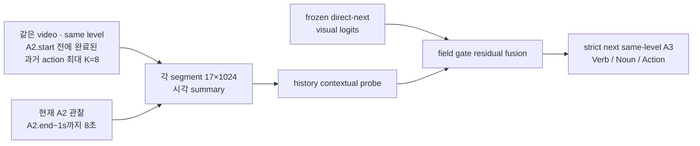
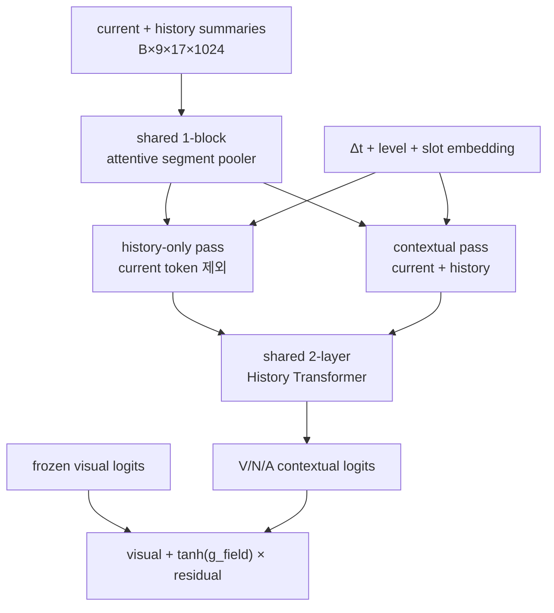
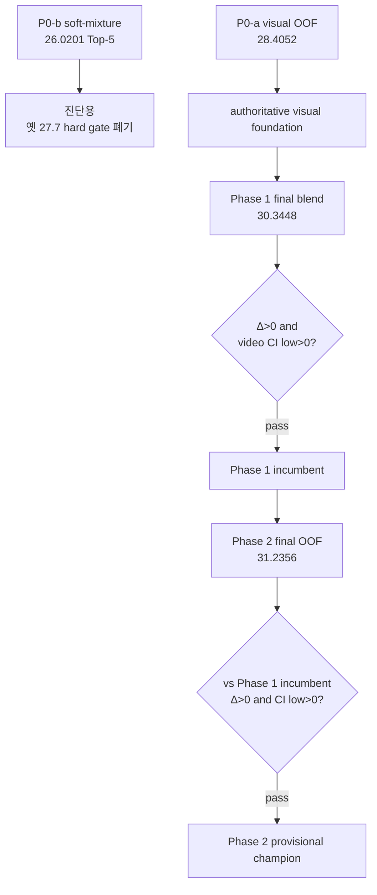

# GoalStep History Context: P0-a · Phase 1 · Phase 2 최종 구현·결과 리포트

- 작성 시각: 2026-07-23 KST (2026-07-22 20:39 UTC 평가 완료)
- 대상: GoalStep V-JEPA2 Step-1 action anticipation
- 최종 계약: **A2.end−1s까지 8초 현재 영상 + 완료된 과거 시각 history K=8 → 다음 same-level action A3**
- 학습 상태: Phase 1 10 epoch 완료, Phase 2 12-arm×10-epoch 후보군 완료, leakage-conscious OOF 평가 완료
- 최종 판정: **Phase 2 OOF recipe를 잠정 engineering champion으로 승격**
- 모델·데이터 재사용 handoff: [2026-07-23_goalstep-history-k8-model-usage-handoff.md](2026-07-23_goalstep-history-k8-model-usage-handoff.md)
- canonical 결과:
  - `outputs/goalstep/runs/z1_history_context_k8_vna_ep10/history_context_vs_p0a_results.json`
  - `outputs/goalstep/runs/z1_history_context_probe_zoo_ep10/phase2_vs_p0a_results.json`
  - `outputs/goalstep/runs/z1_history_context_probe_zoo_ep10/phase2_vs_p0a_oof_scores.pt`

---

## 0. 결론

1. 이 실험은 `end−1s → 현재 action` recognition이 아니다. A2가 끝나기 1초 전까지의 현재 관찰과 A2 이전에 완료된 과거 시각 segment들을 보고, **A2 뒤의 다음 same-level action A3**를 맞힌다.
2. 새 video decode나 V-JEPA backbone feature 추출은 하지 않았다. 기존 endpoint feature bank train 30,374 / val 7,214를 재사용했고, strict-next target cohort train 29,293 / val 6,960용 1.4 GB 파생 summary store만 만들었다.
3. P0-a same-decision visual ensemble의 Action Top-5 **28.4052%**를 기반으로 Phase 1 history를 결합했을 때 최종 OOF blend가 **30.3448%**가 됐다. 리프트는 **+1.9397pp**, paired video-bootstrap 95% CI는 **[+0.7910, +3.2390]pp**다.
4. Phase 2 probe zoo의 최종 OOF recipe는 Action Top-5 **31.2356%**다. Phase 1 incumbent 대비 **+0.8908pp**, 95% CI **[+0.1347, +1.6579]pp**이므로 사전 정의한 잠정 승격 규칙을 통과했다.
5. `+1pp`는 설명용 practical-effect 표지일 뿐 hard gate가 아니다. Phase 2의 +0.8908pp는 +1pp에 못 미치지만, `Δ>0`이고 video-bootstrap CI 하한도 0보다 커서 잠정 승격됐다.
6. 이 승격은 **확증적 결론이 아니다**. 모든 history arm이 같은 validation의 2,000-row subset에서 이전에 선택된 `next_ep03` visual base를 상속하기 때문이다. fresh heldout/test 또는 완전 nested 재학습 전까지는 provisional engineering result로만 해석해야 한다.

### 핵심 Action 결과

| 단계 | CMR@5 | Top-1 | Top-5 | Top-10 | Top-15 | 이전 기준 대비 Top-5 |
|---|---:|---:|---:|---:|---:|---:|
| P0-a visual foundation | 10.0489 | 9.6408 | 28.4052 | 41.5374 | 49.4971 | — |
| Phase 1 selected history | 11.7062 | 10.1149 | 29.9856 | 43.9512 | 52.1121 | +1.5805pp vs P0-a |
| Phase 1 final P0-a blend | 11.7771 | 10.2155 | 30.3448 | 44.1810 | 52.2988 | **+1.9397pp vs P0-a** |
| Phase 2 selected/final | **12.1219** | **10.2155** | **31.2356** | 44.0230 | **52.3851** | **+0.8908pp vs Phase 1** |

Phase 2의 Action 두 outer fold는 모두 blend weight `α=1.0`을 선택했으므로 `phase2_selected`와 `final_blend`가 Action에서 동일하다. Top-10만 보면 Phase 1이 44.1810으로 Phase 2의 44.0230보다 0.1580pp 높다. 승격 기준은 사전 정의대로 Action Top-5다.

---

## 1. 시간·라벨 계약



정확한 불변식은 다음과 같다.

```text
current observation end = A2.end - 1s
history eligibility      = same video_uid and annotation level
                           AND history_action.end <= A2.start
target                    = first later same-level A3 with A3.start >= A2.end
leakage invariant         = max(all observed visual time) < A3.start
```

- action 사이에 annotation이 없는 빈 구간이 있어도 target은 “다음으로 라벨링된 same-level action” A3로 유지한다.
- 빈 구간 길이는 `log1p(Δt)` recency embedding으로 모델에 전달한다.
- history의 action class label은 모델 입력에 넣지 않는다. index의 boundary/level audit column도 입력으로 사용하지 않는다.
- 따라서 이 실험의 `end−1s`는 recognition label A2를 맞히기 위한 것이 아니라, A2가 거의 끝난 시점에서 **그 다음 A3**를 예측하기 위한 decision time이다.

---

## 2. 데이터와 feature 재사용

| 항목 | Train | Val | 설명 |
|---|---:|---:|---|
| 기존 A2 endpoint feature bank | 30,374 | 7,214 | 기존 V-JEPA cache, backbone 재실행 없음 |
| strict-next target cohort | **29,293** | **6,960** | 다음 same-level A3가 존재하는 행 |
| history 길이 0 | 1,043 | 249 | padding/mask로 그대로 포함 |
| history 길이 8 | 22,107 | 5,202 | 최대 K를 모두 채운 행 |
| 평균 history 길이 | 6.845 | 6.820 | target cohort 기준 |

파생 store는 `../datasets/Ego4D/goalstep_history_context_store/`에 있으며 크기는 약 1.4 GB다. train 30 shard, val 8 shard와 `manifest.json`으로 구성된다. 각 segment의 기존 `[temporal, spatial, 1024]` cache를 17개 temporal summary token으로 압축하고 frozen visual logits를 함께 보관한다. 이는 **기존 feature의 I/O 최적화 전처리**이며 새 video decode/backbone feature extraction이 아니다.

파생 index는 다음 방어를 포함한다.

- same `video_uid`, same annotation level만 연결
- `history_action_end <= A2.start` 강제
- target cohort의 sample order와 label을 그대로 보존
- history GT class label 미입력
- train/val index, taxonomy, cache, visual checkpoint, compression contract를 fingerprint로 고정

---

## 3. 모델과 학습 코드

### 3.1 Phase 1 history head

입력 tensor는 `[B, 1+K, 17, 1024] = [B, 9, 17, 1024]`다. 0번 segment가 현재 A2 관찰이고 나머지 8개가 left-padded chronological history다.



- segment pooler: shared cross-attention, 16 heads
- history encoder: 2-layer Transformer, 16 heads, MLP ratio 4, dropout 0.1
- history segment dropout: 0.3
- loss: fused V/N/A focal loss + `0.25 ×` true history-only auxiliary focal loss
- field gate: V/N/A별 scalar, 0 초기화; epoch 0에서 fused와 frozen visual이 bit-exact
- optimizer setting: batch 32, BF16, 10 epochs, LR `3e-4`, WD `1e-4`, warmup 1 epoch
- 평가 mode: `visual`, `history`, `current_only`, `fused`

`current_only`는 같은 contextual branch에서 history token만 제거하는 evaluation-time intervention이다. 따라서 fused와 current-only의 차이는 현재 compressed token을 하나 더 넣은 효과와 실제 history token 효과를 분리하는 데 사용된다.

### 3.2 Phase 2 probe zoo

Phase 2는 Phase 1 구조를 바꾸지 않고 LR/WD만 바꾼 12-arm grid다.

```text
LR ∈ {1e-4, 3e-4, 1e-3}
WD ∈ {1e-5, 1e-4, 1e-3, 1e-2}
```

- Phase 1 기본 arm `(LR=3e-4, WD=1e-4)`은 기존 10-epoch prediction/checkpoint를 감사 후 재사용했다.
- 나머지 11개 arm은 하나의 compact store와 DataLoader를 공유해 동기식으로 10 epoch 학습했다.
- 모든 새 arm은 한 seed-42 template에서 복사했고, per-batch dropout RNG도 replay해 초기화·stochastic mask를 통제했다.
- initialization audit: 11개 arm 동일, Phase 1 epoch-0와 동일, confounded variable 0개.
- 실제 학습 CSV: 110행(11 arms × 10 epochs), epoch wall-time 합계 약 3,876.8초(64.6분).

full-validation에서 탐색적으로 가장 높았던 단일 arm은 `LR=3e-4, WD=1e-2, epoch 6`, Action Top-5 **31.2213%**다. 그러나 이 수치는 모델 선택에 사용된 같은 full val의 최대값이므로 authoritative champion 값이 아니다. 최종 판정은 아래의 outer-fold OOF recipe만 사용한다.

---

## 4. 판단 기준이 어떻게 바뀌었는가

초기 문서의 `25.7 + 2pp = 27.7` 기준은 통계적 임계값이 아니라 history 학습에 GPU 시간을 쓸지 정하기 위한 **수동 compute heuristic**이었다. 논의 후 다음처럼 역할을 재정의했다.



| 단계 | 실제 비교 기준 | 결정 규칙 | 역할 |
|---|---|---|---|
| P0-b | direct next epoch 3 | 옛 +2pp/27.7은 폐기 | deployable transition prior의 진단 |
| P0-a | raw next checkpoints 1–8 | opposite outer fold에서 fieldwise ensemble 학습 | visual foundation |
| Phase 1 | P0-a | paired Action Top-5 `Δ>0` 및 video-bootstrap CI lower `>0` | incumbent 결정 |
| Phase 2 | **Phase 1 final-blend incumbent** | 같은 paired rule | 새 champion 승격 |
| +1pp | 각 비교의 실측 delta | hard gate 아님 | practical magnitude 설명만 |

Phase 2를 P0-a에만 비교하면 이미 Phase 1에서 확보한 이득을 다시 세는 문제가 생긴다. 따라서 Phase 1 final blend 30.3448을 실제 incumbent로 고정하고 Phase 2의 추가 이득만 판정했다.

---

## 5. Phase 0 결과

### 5.1 P0-b는 진단으로만 유지

| Action 방법 | Top-1 | Top-5 | Top-10 | Top-15 | CMR@5 |
|---|---:|---:|---:|---:|---:|
| direct next epoch 3 | 7.36 | 25.65 | 37.86 | 46.03 | 9.84 |
| recognition posterior × train transition OOF | 8.23 | 26.02 | 38.58 | 46.29 | 8.92 |
| GT A2 transition oracle | 10.98 | 30.65 | 41.52 | 48.84 | 15.50 |

P0-b의 direct 대비 이득은 +0.3736pp, video-bootstrap CI `[-1.4786, +2.4129]pp`였다. GT A2 oracle에는 정보가 있지만 recognition posterior를 거쳐서는 안정적으로 회수하지 못했다. 이는 learned visual history가 무익하다는 증거가 아니므로 Phase 1을 막는 hard gate로 쓰지 않았다.

### 5.2 P0-a visual foundation

| Field | CMR@5 | Top-1 | Top-5 | Top-10 | Top-15 |
|---|---:|---:|---:|---:|---:|
| Verb | 19.2073 | 21.6236 | 55.8046 | 71.7241 | 80.8333 |
| Noun | 13.5336 | 29.4109 | 56.3362 | 68.6207 | 75.8333 |
| Action | 10.0489 | 9.6408 | **28.4052** | 41.5374 | 49.4971 |

P0-a는 raw next-action epoch 1–8 probabilities를 video-disjoint 2-fold의 반대 fold에서 V/N/A별 Caruana ensemble로 학습한 OOF 결과다. direct epoch 3 대비 Action Top-5 +2.7586pp, video-bootstrap CI `[+1.67, +3.99]pp`로 visual foundation으로 채택했다.

---

## 6. Phase 1 결과

### 6.1 OOF V/N/A 전체 지표

| Model | Field | CMR@5 | Top-1 | Top-5 | Top-10 | Top-15 |
|---|---|---:|---:|---:|---:|---:|
| P0-a | Verb | 19.2073 | 21.6236 | 55.8046 | 71.7241 | 80.8333 |
| P0-a | Noun | 13.5336 | 29.4109 | 56.3362 | 68.6207 | 75.8333 |
| P0-a | Action | 10.0489 | 9.6408 | 28.4052 | 41.5374 | 49.4971 |
| Phase 1 selected | Verb | 22.0320 | 22.5862 | 56.2356 | 72.8448 | 82.1983 |
| Phase 1 selected | Noun | 15.6899 | 30.1437 | 57.5862 | 69.9856 | 76.9684 |
| Phase 1 selected | Action | 11.7062 | 10.1149 | 29.9856 | 43.9512 | 52.1121 |
| Phase 1 final blend | Verb | 21.3226 | 23.4195 | **57.2126** | 73.1609 | 82.2270 |
| Phase 1 final blend | Noun | 14.9131 | 30.1006 | **58.2040** | 70.2011 | 77.3132 |
| Phase 1 final blend | Action | 11.7771 | 10.2155 | **30.3448** | 44.1810 | 52.2988 |

### 6.2 paired lift와 history attribution

| 비교 | Action Top-5 Δ | Normal 95% CI | Video-bootstrap 95% CI | P(Δ>0) | 판정 |
|---|---:|---:|---:|---:|---|
| Phase 1 selected − P0-a | +1.5805pp | [+0.7383, +2.4227] | [+0.2215, +3.0981] | 0.9897 | 잠정 채택 |
| Phase 1 final blend − P0-a | **+1.9397pp** | [+1.1459, +2.7334] | **[+0.7910, +3.2390]** | 0.9997 | incumbent |
| fused − current-only | **+1.8103pp** | [+1.1311, +2.4896] | **[+0.9461, +2.6923]** | 1.0000 | history 기여 확인 |

full-val epoch 6의 history 길이별 탐색 진단도 의도한 causal pattern과 맞는다.

- history 0개, `n=249`: current-only와 fused Action Top-5가 모두 **23.2932%**로 정확히 같다.
- history 8개, `n=5,202`: current-only **28.5083%** → fused **31.8916%**, **+3.3833pp**.
- epoch 6 gate의 `tanh(g)`: Verb 0.1291, Noun 0.1293, Action 0.1372.

이 bin 결과는 full val에서 epoch 6을 본 뒤 계산한 탐색 진단이며 OOF confirmatory estimate가 아니다.

### 6.3 Phase 1 checkpoint 의미

Phase 1의 full-validation 단일 최고점은 epoch 6, fused Action Top-5 **30.6609%**다. 다음 파일은 모두 epoch 6의 동일한 `model_state`를 담는다.

- `best.pt`
- `best_action_top5.pt`
- `best_fullval_exploratory.pt`
- `checkpoints/epoch_06.pt`

이 별칭들은 편의상 보존한 **exploratory full-validation best**이며 authoritative OOF champion과 같은 개념이 아니다. OOF final 30.3448은 fold/field마다 다른 epoch와 P0-a blend weight를 적용한 prediction recipe다.

---

## 7. Phase 2 결과

### 7.1 OOF V/N/A 전체 지표

| Model | Field | CMR@5 | Top-1 | Top-5 | Top-10 | Top-15 |
|---|---|---:|---:|---:|---:|---:|
| P0-a | Verb | 19.2073 | 21.6236 | 55.8046 | 71.7241 | 80.8333 |
| P0-a | Noun | 13.5336 | 29.4109 | 56.3362 | 68.6207 | 75.8333 |
| P0-a | Action | 10.0489 | 9.6408 | 28.4052 | 41.5374 | 49.4971 |
| Phase 1 incumbent | Verb | 21.3226 | 23.4195 | **57.2126** | 73.1609 | 82.2270 |
| Phase 1 incumbent | Noun | 14.9131 | 30.1006 | 58.2040 | 70.2011 | 77.3132 |
| Phase 1 incumbent | Action | 11.7771 | 10.2155 | 30.3448 | **44.1810** | 52.2988 |
| Phase 2 selected | Verb | **22.1844** | 22.7874 | 56.8822 | 73.0029 | 81.8534 |
| Phase 2 selected | Noun | **16.1164** | **30.2730** | **58.7644** | **70.5603** | 77.3132 |
| Phase 2 selected | Action | **12.1219** | **10.2155** | **31.2356** | 44.0230 | **52.3851** |
| Phase 2 final blend | Verb | 21.0407 | **23.2759** | 56.8965 | **73.0747** | **82.1264** |
| Phase 2 final blend | Noun | **16.1164** | **30.2730** | **58.7644** | **70.5603** | 77.3132 |
| Phase 2 final blend | Action | **12.1219** | **10.2155** | **31.2356** | 44.0230 | **52.3851** |

표의 굵은 글씨는 Phase 2 selected/final 내부의 읽기 편의용이다. Phase 1과 항목별로 모두 이긴다는 뜻은 아니다. 특히 Verb Top-5와 Action Top-10은 Phase 1 incumbent가 더 높다.

### 7.2 paired lift와 승격

| 비교 | Action Top-5 Δ | Normal 95% CI | Video-bootstrap 95% CI | P(Δ>0) | 결과 |
|---|---:|---:|---:|---:|---|
| Phase 2 selected − P0-a | +2.8305pp | [+2.0233, +3.6376] | [+1.7458, +3.9623] | 1.0000 | foundation 대비 개선 |
| Phase 2 final − P0-a | +2.8305pp | [+2.0233, +3.6376] | [+1.7444, +3.9541] | 1.0000 | foundation 대비 개선 |
| **Phase 2 final − Phase 1 incumbent** | **+0.8908pp** | **[+0.3350, +1.4466]** | **[+0.1347, +1.6579]** | **0.9897** | **잠정 승격** |
| Phase 2 fused − independently selected current-only | +2.8448pp | [+2.1865, +3.5031] | [+2.1395, +3.5352] | 1.0000 | history-sensitive pipeline |

최종 판정 문자열은 `phase2_final_blend_promoted_provisionally`다. +1pp descriptive flag는 false지만, 실제 promotion rule인 `delta_top5_pp > 0 AND video-bootstrap CI lower > 0`은 true다.

### 7.3 outer-fold 선택 절차

sample 6,960개, video 128개를 P0-a와 완전히 같은 video-disjoint fold로 나눴다.

- fold 0: 3,737 samples
- fold 1: 3,223 samples
- 각 held-out fold에 대해 반대 fold에서만 선택
- 각 arm/mode에서 tune Top-5 상위 epoch 2개를 남겨 24 candidates 구성
- V/N/A 및 `fused`/`current_only`별 고정 최대 16-round Caruana selection
- P0-a raw epoch 1–8 ensemble도 반대 fold에서 다시 학습
- `final=(1−α)P0-a + α·Phase2`, α grid 0.00–1.00, step 0.05

| Field | Test/Tune fold | P0-a rounds | Fused rounds / unique | Current-only rounds / unique | Phase 2 α | Held-out Top-5: P0-a / P2 / final |
|---|---|---:|---:|---:|---:|---:|
| Verb | 0 / 1 | 12 | 16 / 9 | 13 / 8 | 0.55 | 58.3891 / 60.7707 / 60.2355 |
| Verb | 1 / 0 | 13 | 5 / 4 | 13 / 7 | 0.85 | 52.8079 / 52.3736 / 53.0251 |
| Noun | 0 / 1 | 13 | 13 / 8 | 11 / 4 | 1.00 | 60.3425 / 62.3762 / 62.3762 |
| Noun | 1 / 0 | 16 | 11 / 6 | 6 / 6 | 1.00 | 51.6910 / 54.5765 / 54.5765 |
| Action | 0 / 1 | 11 | 15 / 8 | 13 / 8 | **1.00** | 33.5831 / 37.0618 / 37.0618 |
| Action | 1 / 0 | 14 | 15 / 8 | 13 / 7 | **1.00** | 22.4015 / 24.4803 / 24.4803 |

Action fused의 정확한 selected-with-replacement recipe는 다음과 같다.

**Test fold 0, tune fold 1**

```text
lr_1e-03__wd_1e-04@epoch_02 ×1
lr_1e-04__wd_1e-02@epoch_02 ×1
lr_3e-04__wd_1e-02@epoch_05 ×2
lr_3e-04__wd_1e-02@epoch_06 ×1
lr_3e-04__wd_1e-03@epoch_02 ×2
lr_3e-04__wd_1e-04@epoch_04 ×3
lr_3e-04__wd_1e-05@epoch_02 ×2
lr_3e-04__wd_1e-05@epoch_04 ×3
```

**Test fold 1, tune fold 0**

```text
lr_1e-03__wd_1e-03@epoch_01 ×2
lr_1e-03__wd_1e-05@epoch_01 ×1
lr_1e-04__wd_1e-02@epoch_03 ×2
lr_1e-04__wd_1e-03@epoch_03 ×2
lr_1e-04__wd_1e-03@epoch_04 ×1
lr_3e-04__wd_1e-02@epoch_05 ×2
lr_3e-04__wd_1e-05@epoch_06 ×1
lr_3e-04__wd_1e-05@epoch_08 ×4
```

Verb/Noun/current-only/P0-a의 완전한 multiset과 tune trace는 canonical JSON의 `selection_protocol.fieldwise_outer_fold_selections`에 보존했다.

---

## 8. 모델과 평가 산출물은 무엇이 저장됐는가

### 8.1 Phase 1

| 종류 | 저장 내용 |
|---|---|
| `checkpoints/epoch_00_visual_fallback.pt` | gate=0 visual fallback |
| `checkpoints/epoch_01.pt` … `epoch_10.pt` | **모든 epoch**, model + optimizer + scheduler state |
| `latest.pt` | epoch 10 재개 상태 |
| `best.pt`, `best_action_top5.pt`, `best_fullval_exploratory.pt` | 모두 epoch 6 full-val best와 동일 model state |
| `val_predictions/epoch_00.pt` … `epoch_10.pt` | 모든 mode/head validation logits |
| `history_context_vs_p0a_oof_scores.pt` | P0-a, Phase 1, final blend 등 OOF probabilities와 fold/labels |
| `history_context_vs_p0a_results.json` | selection recipe, V/N/A metrics, paired CI, validity scope |

Phase 1 run directory의 현재 크기는 약 **7.1 GB**다. 사용자가 특별히 지목한 “Phase 1에서 제일 좋았던 모델”은 삭제되지 않았고, epoch 6 원본 및 세 best alias로 중복 보존돼 있다.

### 8.2 Phase 2

| 종류 | 수량/의미 |
|---|---|
| 새 arm model-only checkpoints | **110개 = 11 arms × 10 epochs**, 각 약 158 MB |
| 새 arm validation predictions | **110개**, 각 약 58 MB |
| 기본 Phase 1 arm | 기존 10개 epoch prediction/checkpoint를 hash audit 후 재사용 |
| `latest_resume.pt` | 11개 arm의 optimizer/scheduler/RNG를 묶은 atomic resume state, 약 5.2 GB |
| `phase2_vs_p0a_oof_scores.pt` | 최종 OOF probability와 exact recipe, 약 70 MB |
| `phase2_vs_p0a_results.json` | 최종 metrics/lift/CI/selection/provenance, 약 356 KB |

Phase 2 run directory는 약 **28 GB**다. 새로 학습한 모든 arm/epoch 모델이 저장되어 있다.

중요한 의미 구분은 다음과 같다.

- “단일 checkpoint”가 필요하면 Phase 1 epoch 6 alias 또는 Phase 2의 특정 `arm/epoch` 파일을 로드할 수 있다.
- authoritative Phase 1/2 OOF 점수는 fold와 field마다 서로 다른 epoch/arm을 선택한 **평가 recipe**다. 따라서 하나의 `best_phase2.pt`와 동치가 아니다.
- 최종 recipe 재현에 필요한 probabilities, labels, folds, selection multiset은 OOF score artifact와 JSON에 모두 저장됐다.
- 실제 단일 배포 모델이 필요하면 별도 untouched train/tune 계약으로 recipe를 고정한 뒤 full-train refit 또는 고정 ensemble package를 만들어야 한다.

---

## 9. 변경·추가된 코드 인벤토리

| 영역 | 파일 | 역할 |
|---|---|---|
| history index | `src/ego/step1_action_anticipation/goalstep/build_goalstep_history_index.py` | same-video/same-level K=8 체인 및 leakage assertion |
| index asset | `src/ego/step1_action_anticipation/goalstep/index_end_m1_lobs8_next_action_history_k8/` | train/val parquet, registry, build stats |
| derived store | `scripts/step1/goalstep/prepare_history_context_store.py` | 기존 V-JEPA cache → 17-token summary/frozen logits |
| cache/data | `src/ego/step1_action_anticipation/data/feature_cache.py` | cache ID lookup와 label override/reuse 경로 |
| model | `src/ego/step1_action_anticipation/models/history_context_head.py` | shared pooler, history transformer, field gates, ablations |
| Phase 1 trainer | `src/ego/step1_action_anticipation/goalstep/train_goalstep_history_context.py` | 10-epoch 학습, full metrics, checkpoints/predictions |
| Phase 1 config | `configs/step1/goalstep/z1_history_context_k8_vna_ep10.yaml` | 데이터·모델·학습·평가 계약 |
| Phase 1 evaluator | `scripts/step1/goalstep/evaluate_history_context_vs_p0a.py` | P0-a 재학습, foldwise epoch/alpha, paired bootstrap |
| Phase 1 queue | `scripts/step1/goalstep/run_history_phase1_after_store.sh` | persistent serial execution |
| obsolete gate entry | `scripts/step1/goalstep/run_history_context_champion_after_gate.sh` | 옛 P0-b hard-gate 경로 fail-closed tombstone |
| Phase 2 trainer | `src/ego/step1_action_anticipation/goalstep/train_goalstep_history_probe_zoo.py` | shared-loader 11-arm 학습, atomic resume |
| Phase 2 config | `configs/step1/goalstep/z1_history_context_probe_zoo_ep10.yaml` | 고정 12-arm LR/WD grid |
| Phase 2 evaluator | `scripts/step1/goalstep/evaluate_history_probe_zoo_vs_p0a.py` | outer-fold prefilter/Caruana/blend/promotion |
| Phase 2 launcher | `scripts/step1/goalstep/run_history_probe_zoo.sh` | Phase 1 artifact 확인 → zoo → evaluator |
| Phase 1 tests | `tests/smoke/test_goalstep_history_context_phase1.py`, `tests/unit/test_goalstep_history_vs_p0a.py` | gate=0, artifact, fold leakage 방어 |
| Phase 2 tests | `tests/smoke/test_goalstep_history_probe_zoo.py`, `tests/unit/test_goalstep_history_probe_zoo_evaluator.py` | grid/resume/default reuse/selection/promotion/provenance |
| 통합 UI | `tools/goalstep_experiments_dashboard.py` | Phase 1/2와 adaptive 상태/metrics/log를 한 페이지에 표시 |

Phase 2 evaluator의 최종 중요한 보강은 다음 두 가지다.

1. promotion baseline을 P0-a가 아니라 **Phase 1 final-blend incumbent**로 고정했다.
2. Phase 1 OOF 파일의 canonical path, SHA-256, byte size가 Phase 2 시작 manifest의 frozen inventory와 모두 정확히 같은지 fail-closed 검사한다.

---

## 10. 재현성·검증

### 10.1 provenance

- Phase 2 provenance fingerprint: `7174fb43588326cf9450b9d274fa24f861cb046cae025df53e6ad58ea1f250fa`
- Phase 2 result SHA-256: `9e6309b1f614fb25eeb7b528043b643274214816a19627f5e4ee5b9acd784686`
- Phase 2 OOF score SHA-256: `2999464e811559c01f67e948db1e594b3e88c71ce48d41e12fe717f2b3bb8b48`
- frozen Phase 1 OOF SHA-256: `11e931e65d9cb62ab0ed7f1b9327c456794acaa9c05941c697e1d2004c5a0990`
- Phase 2 manifest에서 frozen Phase 1 OOF의 path/hash/bytes/unique-entry 검사가 모두 true다.
- raw P0-a reconstruction maximum error: Verb `7.45e-9`, Noun `3.73e-9`, Action `6.98e-10`.
- sample ID order, video UID order, labels, history length가 모든 arm/epoch에서 exact로 일치한다.

### 10.2 실행 검증

- Phase 2 trainer exit: 0
- Phase 2 outer-fold evaluator exit: 0
- OOF score artifact의 probability normalization, label alignment, Top-1/5/10/15를 JSON과 독립 재계산: PASS
- Phase 1 CPU synthetic smoke: PASS
- Phase 1 evaluator unit: 3/3 PASS
- Phase 2 shared-loader/resume CPU synthetic smoke: PASS
- Phase 2 evaluator/provenance/promotion unit: 7/7 PASS
- 위 검증은 실제 pipeline interpreter인 `eve-cu124`와 `PYTHONPATH=<repo>/src`에서 수행했다. 이 interpreter에는 `pytest` module이 없으므로 smoke script와 `python -m unittest` entrypoint를 사용했다. 시스템 기본 Python은 사용하지 않으며, 그 환경에는 서로 다른 NumPy 설치가 섞여 bootstrap unit 2개가 import 단계에서 실패하는 별도 환경 문제가 있다.

---

## 11. 한계

1. **상속된 validation adaptivity**: frozen visual source `next_ep03`가 같은 validation split의 seed-42 2,000-row subset Action Top-5로 이전에 선택됐다. 이번 outer-fold는 새 arm/epoch/ensemble/α 선택 leakage는 막지만 이 과거 선택을 되돌릴 수 없다.
2. **untouched test 부재**: 두 outer fold는 모든 row에 OOF prediction을 만들지만 완전히 손대지 않은 최종 test set은 아니다. 따라서 bootstrap CI도 confirmatory CI로 해석할 수 없다.
3. **bootstrap의 조건부 범위**: paired video-cluster bootstrap은 이미 선택된 OOF prediction을 고정한 채 video를 resample한다. arm/epoch/ensemble 선택 전체를 bootstrap 안에서 재실행하지 않는다.
4. **OOF recipe와 단일 배포 checkpoint의 차이**: 최종 수치는 fold/field별 모델 집합이다. 하나의 deployable checkpoint 성능으로 표현하면 안 된다.
5. **current-only 해석**: Phase 1의 same-selected-epoch intervention도 history가 학습 중 만든 regularization 효과까지 없애지는 못한다. Phase 2의 `fused_vs_current_only`는 두 mode를 각각 독립 prefilter/ensemble한 pipeline 비교라 더 엄격한 same-arm/same-epoch causal effect가 아니다.
6. **oracle boundary/level**: history class label은 입력하지 않지만 history membership은 GoalStep의 GT action boundary와 annotation level로 구성했다. online deployment에는 boundary/level estimator가 필요하다.
7. **공간 압축**: 과거 segment의 spatial token을 temporal slice별로 평균해 17-token summary로 만든 근사다. full-spatial history보다 표현력이 낮을 수 있다.
8. **fold 이질성**: Action Phase 2 held-out Top-5가 fold 0에서 37.06, fold 1에서 24.48로 차이가 크다. video/scenario 구성 이질성을 추가 분석해야 한다.
9. **Phase 3 미실행**: V-JEPA2.1 ViT-G/384 교체는 새 backbone feature 추출과 대규모 저장 공간이 필요해 이번 same-cache pipeline 범위에 포함하지 않았다.

확증을 위해서는 다음 중 하나가 필요하다.

- fresh heldout/test에서 recipe를 한 번만 평가
- visual-base checkpoint 선택부터 history residual 학습, zoo selection까지 outer fold 안에서 완전히 nested 수행
- 사전에 고정한 단일/ensemble recipe를 full train에 refit한 뒤 별도 test 평가

---

## 12. Adaptive A1 boundary · MR24+8 재개 운영

이 리포트 작성 직전의 보존 상태는 다음과 같다.

| 항목 | 상태 |
|---|---|
| run | `z1_adaptive_transition_mr24x8_vna_ep10` |
| stage | train feature extraction에서 paused |
| val cache | 4,458 / 4,458 완료 |
| train cache | 12,472 / 18,962 완료 |
| train 잔여 | 6,490 |
| resume script | `scripts/step1/goalstep/run_adaptive_transition_mr24x8_vna_ep10.sh` |
| tmux | `ego_goalstep_adaptive_transition` |

resume script를 다시 실행하면 완성된 cache sample은 skip하고 train 잔여분부터 이어간 뒤 10-epoch 학습으로 넘어간다. 통합 UI는 adaptive process를 자동 감지한다.

- 통합 UI: <https://parts-sleeve-handbook-bidder.trycloudflare.com>

### 12.1 재개 영수증

리포트 본문을 먼저 저장·검수한 뒤 다음과 같이 재개했다. 따라서 “Phase 2 완료 → 최종 리포트 고정 → adaptive 재개” 순서를 지켰다.

| 항목 | 실제 기록 |
|---|---|
| 재개 UTC | **2026-07-22 20:45:30** |
| tmux | `ego_goalstep_adaptive_transition:0` |
| launcher PID | `929227` |
| 실행 명령 | `bash scripts/step1/goalstep/run_adaptive_transition_mr24x8_vna_ep10.sh` |
| val 재검증 | 20:45:45 UTC 완료, **saved 0 / skipped 4,458 / total 4,458** |
| train 재개 snapshot | 20:46:13 UTC, **12,472 / 18,962**, 잔여 6,490 |
| 현재 stage | `train_feature_extraction` |
| 통합 UI | `feature_extraction`, progress 36.14%로 감지 |
| 상태 파일 | `run_status.json`을 `running`으로 갱신 |

resume launcher는 기존 `pipeline.log`를 덮어쓰지 않고 재개 이벤트를 append하도록 보강했다. 실제 로그에는 20:45:30 시작, 20:45:45 val skip 완료, 이어서 train 추출 시작이 연속적으로 남아 있다. extractor worker PID는 작업 중 바뀔 수 있으므로 장기 추적의 정본은 tmux window와 launcher PID다.

---

## 13. Canonical 산출물

| 산출물 | 경로 |
|---|---|
| P0-b 결과 | `outputs/goalstep/runs/history_context_phase0/p0b_results.json` |
| P0-a 결과 | `outputs/goalstep/runs/history_context_phase0/p0a_primary_same_decision_results.json` |
| P0-a OOF scores | `outputs/goalstep/runs/history_context_phase0/p0a_primary_same_decision_oof_scores.pt` |
| Phase 1 full metrics | `outputs/goalstep/runs/z1_history_context_k8_vna_ep10/final_metrics.json` |
| Phase 1 OOF result | `outputs/goalstep/runs/z1_history_context_k8_vna_ep10/history_context_vs_p0a_results.json` |
| Phase 1 OOF scores | `outputs/goalstep/runs/z1_history_context_k8_vna_ep10/history_context_vs_p0a_oof_scores.pt` |
| Phase 2 manifest | `outputs/goalstep/runs/z1_history_context_probe_zoo_ep10/run_manifest.json` |
| Phase 2 initialization audit | `outputs/goalstep/runs/z1_history_context_probe_zoo_ep10/initialization_audit.json` |
| Phase 2 training completion | `outputs/goalstep/runs/z1_history_context_probe_zoo_ep10/final_metrics.json` |
| **Phase 2 canonical result** | `outputs/goalstep/runs/z1_history_context_probe_zoo_ep10/phase2_vs_p0a_results.json` |
| **Phase 2 canonical OOF scores** | `outputs/goalstep/runs/z1_history_context_probe_zoo_ep10/phase2_vs_p0a_oof_scores.pt` |
| adaptive pause/resume status | `outputs/goalstep/runs/z1_adaptive_transition_mr24x8_vna_ep10/run_status.json` |

최종적으로 보존할 숫자는 **Action Top-5 31.2356%**, Phase 1 incumbent 대비 **+0.8908pp**, video-bootstrap CI **[+0.1347, +1.6579]pp**다. 이는 Phase 2의 잠정 engineering champion 결과이며 confirmatory test 결과는 아니다.
