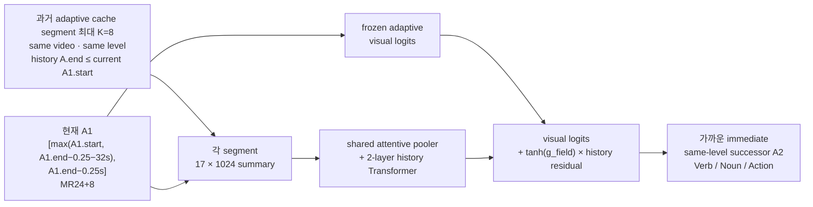

# GoalStep Adaptive Transition + Visual History K=8 Phase 1 Handoff

- 작성일: 2026-07-24
- 상태: **10 epoch 정상 완료 · 저장 검증 완료**
- 실험 ID: `goalstep_z1_adaptive_transition_history_context_k8_vna_ep10`
- 실행 세션: `ego_goalstep_adaptive_history_phase1:pipeline` (완료 후 정상 종료)
- 실시간 UI: <https://parts-sleeve-handbook-bidder.trycloudflare.com>
- 기준 문서:
  - [GoalStep History Context 구현 Handoff](2026-07-23_goalstep-history-context-implementation-handoff.md)
  - [GoalStep Adaptive Transition Window 제안](2026-07-22_goalstep-adaptive-transition-window-proposal.md)

## 1. 목적과 결론

이번 실험은 기존 Phase 1의 **시각 history residual 학습법**은 유지하되,
현재 segment와 target을 고정 `A2.end−1s → A3` 계약이 아니라 이미 전처리된
**adaptive transition `A1 → A2` cohort**로 교체한 ablation이다.

```text
현재 evidence
  adaptive MR24+8로 A1을 A1.end−0.25s까지만 관찰

과거 evidence
  같은 video·같은 annotation level에서
  현재 A1 시작 전에 완료된 adaptive-cache action 최대 8개

target
  close immediate same-level successor A2
```

즉, 모델은 A2 frame을 보지 않고 **A1과 그보다 과거인 시각 history로 다음 A2를
예측**한다. 현재 A1을 맞히는 action recognition 실험이 아니며, history의 GT
verb/noun/action label도 입력하지 않는다.

기존 adaptive V-JEPA cache가 train **18,962**, validation **4,458**행 모두
완비되어 있으므로 **영상 디코딩 또는 V-JEPA backbone feature 재추출은 하지
않는다.** 다만 매 epoch마다 대형 원본 피처를 반복해서 읽지 않도록
`[4352, 1024] → [17, 1024]` spatial-mean temporal summary로 바꾸는 compact
derived store를 한 번 생성한다. 이 단계는 새 feature extraction이 아니라
기존 feature의 압축·재배열과 frozen visual logits 계산이다.

## 2. 정확한 시간·라벨 계약



현재 `A1 → A2` pair는 다음 조건으로 만들어진 기존 adaptive index를 그대로
사용한다.

```text
A1.video_uid == A2.video_uid
A1.annotation_level == A2.annotation_level
A2.start >= A1.end
A1.duration >= 1.0s
gap = A2.start - A1.end
gap <= min(2.0s, 0.20 * A1.duration)
```

현재 A1 observation은 다음과 같다.

```text
cutoff    = A1.end - 0.25s
obs_start = max(A1.start, cutoff - 32s)
observation = [obs_start, cutoff]
sampling    = 24 global + terminal 2초의 8 frame
target      = A2
```

history index는 각 adaptive 행이 관찰한 action A1을 하나의 cached segment로
간주한다. 현재 A1에 대해 다음 조건을 만족하는 과거 segment 중 가장 최근 8개를
시간순으로 선택한다.

```text
history.video_uid == current.video_uid
history.annotation_level == current.annotation_level
history.observed_action_end_sec <= current.observed_action_start_sec
```

- 순서는 left padding 뒤 oldest-to-newest다.
- history temporal feature는
  `current.obs_end_sec - history.obs_end_sec`다.
- 현재 observation은 항상 target 시작보다 앞선다. 실측 최소 margin은 0.25초다.
- history index의 모델 입력 column에는 과거 GT class label이 없다.

## 3. 데이터와 history 통계

train/validation row를 추가로 버리지 않고 adaptive cohort 전체를 유지했다.

| Split | 기존 adaptive cache | Phase 1 target | 평균 history | history 0개 | history 8개 |
|---|---:|---:|---:|---:|---:|
| Train | 18,962 | **18,962** | 6.3938 | 1,001 | 12,700 |
| Validation | 4,458 | **4,458** | 6.3811 | 234 | 2,960 |

history 길이의 전체 histogram은 다음과 같다.

| Split | 0 | 1 | 2 | 3 | 4 | 5 | 6 | 7 | 8 |
|---|---:|---:|---:|---:|---:|---:|---:|---:|---:|
| Train | 1,001 | 921 | 852 | 788 | 738 | 689 | 657 | 616 | 12,700 |
| Validation | 234 | 217 | 201 | 187 | 178 | 167 | 158 | 156 | 2,960 |

taxonomy는 adaptive cache와 동일한 Verb 81 / Noun 140 / Action 293 class registry를
사용한다. train/validation cache와 history index는 서로 분리되며, history도 각
split 내부에서만 찾는다.

## 4. 모델과 10-epoch 학습 설정

Phase 1 모델은 기존 history-context head와 동일하다.

- 입력: `[B, current+8, 17, 1024]`
- segment pooler: shared 1-block cross-attention, 16 heads
- context: history `log1p(Δt)` MLP + level/slot embedding
- history Transformer: 2 layers, 16 heads, MLP ratio 4.0, dropout 0.1
- fusion:
  `frozen_visual_logits + tanh(g_field) * contextual_logits`
- Verb/Noun/Action gate: 0 초기화
- segment dropout: 0.3
- history-only auxiliary focal-loss weight: 0.25
- recency scale: 300초

학습 설정은 다음과 같다.

| 항목 | 값 |
|---|---:|
| Epoch | **10** |
| Train / eval batch | 32 / 64 |
| Learning rate | `3e-4` |
| Weight decay | `1e-4` |
| Warmup | 1 epoch |
| Final LR | 0 |
| Focal γ / α | 2.0 / 0.25 |
| Gradient clip | 1.0 |
| Precision | bf16 |
| Seed | 42 |
| Validation | 매 epoch full validation 4,458행 |
| Checkpoint 선택 | `fused.action.top5` |

epoch 0은 gate가 0인 frozen adaptive visual fallback이며 fused와 visual이
bit-exact하게 같아야 한다. 이후 매 epoch `visual`, `history`, `current_only`,
`fused` 네 mode를 평가한다.

## 5. 평가 기준과 기준선

사용자가 요청한 주 보고 지표는 **Action Top-1 / Top-5 / Top-10 accuracy**다.
CMR@5와 Top-15, Verb/Noun 지표도 artifact에는 함께 남기지만 UI와 최종 요약에서는
Action Top-1/5/10을 우선해서 읽는다.

같은 adaptive cohort의 frozen visual source는 기존 adaptive MR24+8
`best_action_top5.pt`다. 이 checkpoint는 고정 validation subset 2,000행에서
epoch 4로 선택된 뒤 full validation 4,458행에서 다음 값을 냈다.

| 모델 | Action Top-1 | Action Top-5 | Action Top-10 |
|---|---:|---:|---:|
| Frozen adaptive visual baseline | **9.3988** | **26.7384** | **39.5917** |
| Phase 1 fused best (epoch 5) | **10.6326** | **30.5518** | **44.5043** |
| Phase 1 fused − visual | **+1.2337 pp** | **+3.8134 pp** | **+4.9125 pp** |

이 실험에는 기존 endpoint 계약의 P0-a/P0-b를 gate나 기준선으로 가져오지 않는다.
cohort와 prediction contract가 다르기 때문이다. `phase0.policy`는
`not_applicable`이며, 판정은 동일 adaptive validation cohort 안에서
`fused − frozen visual`의 Action Top-5 차이를 중심으로 기술한다. Top-1과
Top-10도 반드시 함께 보고한다.

중요하게도 이것은 **exploratory full-validation ablation**이다. 같은 full
validation으로 epoch를 선택하므로, 개선이 관찰되더라도 OOF 또는 untouched-test의
확증적 승격 결과로 표현하지 않는다.

### 완료 후 채울 결과 템플릿

| 항목 | 값 |
|---|---|
| Best epoch | **5** |
| Fused Action Top-1 | **10.6326** |
| Fused Action Top-5 | **30.5518** |
| Fused Action Top-10 | **44.5043** |
| Visual 대비 Top-1 Δ | **+1.2337 pp** |
| Visual 대비 Top-5 Δ | **+3.8134 pp** |
| Visual 대비 Top-10 Δ | **+4.9125 pp** |
| 해석 범위 | adaptive close-pair matched cohort의 exploratory full-val 결과 |

## 6. 현재 실행 상태와 운영

작성 시점의 pipeline 상태는 다음과 같다.

```text
[완료] adaptive K=8 history index 생성
[완료] 기존 [4352,1024] cache → [17,1024] derived store 생성
[완료] epoch 0 frozen visual fallback 재현
[완료] Phase 1 10-epoch 학습 + 매 epoch full validation
[완료] epoch 5 best와 epoch 10 latest/final artifact 저장
```

pipeline은 한 tmux 창 안에서 위 단계를 직렬 실행했으며, 모든 단계가 정상 완료된
뒤 세션이 종료됐다. 현재 실행 중인 trainer는 없고 GPU도 비어 있다.

통합 UI의
`adaptive A1 boundary · MR24+8 · visual history K=8` 카드에서 derived-store
train/val 진행량, 학습 epoch, Action Top-1/5/10 곡선, 현재 best와 최근 로그를
5초 간격으로 확인할 수 있다.

- public UI: <https://parts-sleeve-handbook-bidder.trycloudflare.com>
- 로컬 API: `http://127.0.0.1:17867/api/status`
- UI 서버/tunnel tmux: `ego_goalstep_overview`

## 7. 코드·데이터·산출물 경로

| 종류 | 경로 |
|---|---|
| 기존 adaptive index | `src/ego/step1_action_anticipation/goalstep/index_adaptive_transition_mr24x8/` |
| **기존 adaptive V-JEPA cache** | `../datasets/Ego4D/goalstep_feature_cache_adaptive_transition_mr24x8_vna/` |
| frozen visual config | `configs/step1/goalstep/z1_adaptive_transition_mr24x8_vna_ep10.yaml` |
| frozen visual checkpoint | `outputs/goalstep/runs/z1_adaptive_transition_mr24x8_vna_ep10/best_action_top5.pt` |
| adaptive history builder | `src/ego/step1_action_anticipation/goalstep/build_goalstep_adaptive_history_index.py` |
| **K=8 history index** | `src/ego/step1_action_anticipation/goalstep/index_adaptive_transition_mr24x8_history_k8/` |
| derived-store builder | `scripts/step1/goalstep/prepare_history_context_store.py` |
| **compact derived store** | `../datasets/Ego4D/goalstep_history_context_store_adaptive_transition_mr24x8/` |
| history model | `src/ego/step1_action_anticipation/models/history_context_head.py` |
| Phase 1 trainer | `src/ego/step1_action_anticipation/goalstep/train_goalstep_history_context.py` |
| **실험 config** | `configs/step1/goalstep/z1_adaptive_transition_history_context_k8_vna_ep10.yaml` |
| persistent launcher | `scripts/step1/goalstep/run_adaptive_transition_history_context_k8_vna_ep10.sh` |
| UI 구현 | `tools/goalstep_experiments_dashboard.py` |
| **run directory** | `outputs/goalstep/runs/z1_adaptive_transition_history_context_k8_vna_ep10/` |
| pipeline/index/store/train 로그 | 위 run directory의 `logs/` |

학습이 끝나면 run directory에 다음 핵심 artifact가 생성된다.

- `checkpoints/epoch_00_visual_fallback.pt`
- `checkpoints/epoch_01.pt` … `epoch_10.pt`
- `best.pt`, `best_action_top5.pt`, `best_fullval_exploratory.pt`
- `latest.pt`
- `val_predictions/epoch_00.pt` … `epoch_10.pt`
- `training_history.csv`
- `final_metrics.json`

`best_action_top5.pt`는 이 실험의 full-validation exploratory best 단일
checkpoint다. 별도 OOF recipe나 untouched-test champion으로 오해하면 안 된다.

## 8. 구현 검증

실행 전에 다음 검증을 통과했다.

- adaptive history index 및 기존 history pipeline 관련 focused tests:
  **10 passed**
- 실데이터 history audit:
  train/val 전 행 유지, history GT label 미포함, current-before-target와
  completed-history causality 통과
- 실제 adaptive `best_action_top5.pt` strict state load 통과
- 실제 adaptive cache 한 batch forward 통과:
  Verb/Noun/Action logits가 각각 81/140/293 class shape로 생성됨
- 전체 validation epoch 0 bit-exact fallback 통과:
  Action Top-1 9.40 / Top-5 26.74 / Top-10 39.59로 기존 frozen baseline 재현
- dashboard Python compile 및 9개 실험 card status 렌더링 통과

여기서 `10 passed`는 이번 변경과 직접 관련된 focused test 범위이며 저장소 전체
test suite를 의미하지 않는다.

## 9. 해석 한계

1. **Oracle boundary와 level**  
   adaptive A1 observation 경계와 history membership은 GoalStep GT action
   boundary 및 `annotation_level`을 사용한다. online 배포에는 이를 예측할
   upstream boundary/level estimator가 필요하다.

2. **Close-pair conditional cohort**  
   target은
   `gap <= min(2s, 0.20 × A1.duration)`을 만족하는 immediate same-level A2만
   포함한다. 따라서 결과는 전체 timeline 또는 긴 공백을 포함한 모든 다음
   action에 대한 성능 추정치가 아니다.

3. **History pool이 모든 annotation을 덮지 않는다**  
   history 후보는 기존 adaptive close-pair cache에 들어 있는 observed A1
   segment로 제한된다. 같은 video/level의 모든 annotated action을 완전하게
   history bank로 만든 것은 아니다. `history 0개`가 곧 실제 과거 action이
   없다는 뜻은 아니다.

4. **Adaptive metadata 비대칭**  
   frozen adaptive visual head는 observation duration, A1 duration,
   frame-time positions, terminal mask, annotation level을 사용한다. 반면
   변경하지 않은 Phase 1 history residual은 각 segment의 17-token summary와
   history Δt/level/slot만 받고, adaptive duration/time/terminal mask를 직접
   받지 않는다. 따라서 history branch가 MR24+8의 모든 시간 구조를 활용하는
   실험은 아니다.

5. **Full-validation adaptivity**  
   `fused.action.top5`로 같은 validation의 best epoch를 선택한다. 성능 lift는
   matched-cohort의 탐색 결과로만 기술해야 하며, 확증하려면 고정 recipe를
   별도 held-out/test에서 한 번 평가하거나 selection 전체를 fold 안에 넣어야 한다.

6. **공간 압축**  
   `[4352,1024]`의 spatial token을 17개 temporal summary로 압축한다. I/O를
   크게 줄이는 대신 full-spatial history보다 표현력이 낮을 수 있다.

## 10. 다음 사람이 확인할 순서

1. UI에서 실험이 `completed`인지 확인
2. `logs/pipeline.log`, `logs/store.log`, `logs/train.log` 순서로 완료 상태 확인
3. `final_metrics.json`의 best epoch와
   `training_history.csv`의 `fused_action_top1/top5/top10` 대조
4. `best_action_top5.pt`의 metadata에서 adaptive prediction/history contract 확인
5. 위 결과 템플릿을 실측값으로 갱신하되, baseline 대비 Δ를 percentage point로 표기
6. 결과를 close-pair exploratory full-val 범위 밖으로 일반화하지 않기
